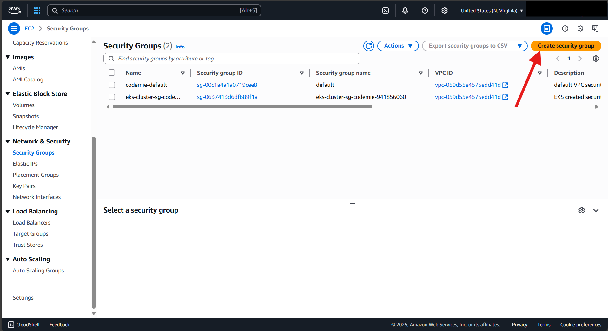
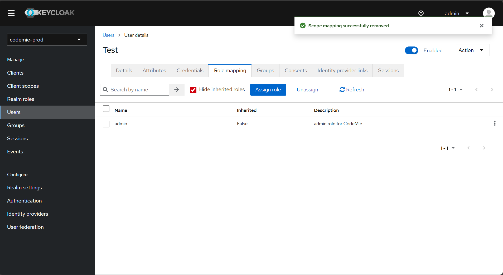

# AWS Marketplace AI/Run Deployment Guide

[](https://opensource.org/licenses/Apache-2.0)

This guide provides step-by-step instructions for deploying the EPAM AI/Run™ for AWS application to Amazon EKS and related AWS services.

## Table of Contents

1. [Overview](#1-overview)
2. [Prerequisites](#2-prerequisites)
3. [AI/Run CodeMie Architecture](#3-airun-codemie-deployment-architecture)
4. [AWS Infrastructure Deployment](#4-aws-infrastructure-deployment)
5. [AI Models Integration and Configuration](#5-ai-models-integration-and-configuration)
6. [AI/Run CodeMie Components Deployment](#6-airun-codemie-components-deployment) 
7. [Application Access](#7-provide-access-to-the-application) 
8. [AWS Bedrock Configuration](#8-airun-codemie-post-installation-configuration)
9. [Configure AWS Bedrock](#9-configure-aws-bedrock)
10. [Import AWS Bedrock entity into CodeMie](#10-import-aws-bedrock-entity-into-codemie)


# 1. Overview

This guide provides step-by-step instructions for deploying the EPAM AI/Run™ for AWS application to Amazon EKS and related AWS services. By following these instructions, you will:

* Get along with EPAM AI/Run™ for AWS architecture
* Deploy AWS infrastructure using Terraform
* Configure and deploy all EPAM AI/Run™ for AWS application components
* Integrate and configure AI modes

## 1.1. How to Use This Guide

For successful deployment, please follow these steps in sequence:
1. First, verify all prerequisites and set up your AWS environment accordingly. Next, deploy the required infrastructure using Terraform.
2. Finally, deploy and configure the EPAM AI/Run™ for AWS components on EKS cluster.
3. Complete post-installation configuration.

Each installation step is designed to ensure a smooth deployment process. The guide is structured to walk you through from initial setup to a fully functional EPAM AI/Run™ for AWS environment on AWS.

# 2. Prerequisites

Before installing EPAM AI/Run™ for AWS, carefully review the prerequisites and requirements.

## 2.1. Prerequisites Checklist

### 2.1.1.1. AWS Account Access Requirements
✓ Active AWS Account with preferably region for deployment  
✓ User or Role with programmatic access to AWS account with permissions to create and manage IAM Roles and Policy Documents

### 2.1.1.2. Domain Name
✓ Available wildcard DNS hosted zone in Route53  
📋 EPAM AI/Run™ for AWS terraform modules will automatically create:
* DNS Records
* TLS certificate through AWS Certificate Manager, which will be used later by the ALB and NLB


### 2.1.1.3. External connections
✓ Firewall or SG and NACLs of EKS cluster allow outbound access to:
* EPAM AI/Run™ for AWS container registry – <Need Update>
* 3rd party container registries – quay.io, docker.io, registry.developer.zurich/data.com
* Any service you're planning to use with EPAM AI/Run™ for AWS (for example, GitHub instance)
  ✓ Firewall on your integration service allow inbound traffic from the EPAM AI/Run™ for AWS NAT Gateway public IP address

ℹ️ NAT Gateway public IP address will be known after EKS installation

### 2.1.1.4. LLM Models
✓ Activated region in AWS where AWS Bedrock Models are available
✓ Activated desired LLMs and embeddings models in AWS account (for example, Sonnet 3.5/3.7, AWS Titan 2.0)

ℹ️ EPAM AI/Run™ for AWS can be deployed with mock LLM configurations initially. Real configurations can be provided later if client-side approvals require additional time.

> ⚠️ **Important**: EPAM AI/Run™ for AWS requires at least one configured chat model and one embedding model to function properly. Ensure these are set up before proceeding with creating assistants or data sources.

### 2.1.1.5. User Permissions and Admission Control Requirements for EKS
✓ Admin EKS permissions with rights to create `namespaces`
✓ Admission webhook allows creation of Kubernetes resources listed below (applicable when deploying onto an existing EKS cluster with enforced policies):

| EPAM AI/Run™ for AWS Component | Kubernetes APIs | Description |
|--------------------------------|-----------------|-------------|
| NATS                           | `Service` | NATS messaging system requires a LoadBalancer service type for client-server communication. When running `codemile-plugins`: <br>– within the same VPC as the EKS cluster – internal LoadBalancer configured for secure, private network communication<br>– outside the EKS cluster's VPC – Public LoadBalancer required for cross-network communication |
| keycloak-operator              | `ClusterRole`, `ClusterRoleBinding`, `Role`, `RoleBinding`, `CRDs`, `CR` | Cluster-wide permissions required for managing Keycloak configuration, including realm, clients, and user federation settings |
| Postgres-operator              | `ClusterRole`, `ClusterRoleBinding`, `CRDs`, `CR` | Cluster-wide permissions required for managing PostgreSQL instances and their lifecycle |
| ElasticSearch                  | `Pod[securityContext]` | InitContainer must run as root user to set system parameter `vm.max_map_count=262144` |
| All components                 | `Pod[securityContext]` | All components require SecurityContext with `readOnlyRootFilesystem: false` for proper operation |

## 2.2. Deployer instance requirements
✓ The following software must be pre-installed and configured on the deployer laptop or VDI instance before beginning the deployment process(if you're using Windows, avoid mixing WSL with a native Windows installation):
* [terraform](https://developer.hashicorp.com/terraform/tutorials/aws-get-started/install-cli) `v1.5.7`
* [kubectl](https://kubernetes.io/docs/tasks/tools/#kubectl)
* [helm](https://helm.sh/docs/intro/install/)  `v3.16.0+`
* [AWS CLI](https://docs.aws.amazon.com/cli/latest/userguide/getting-started-install.html)
* [docker](https://docs.docker.com/get-started/get-docker/)
* [natscli](https://github.com/nats-io/natscli?tab=readme-ov-file#installation)
* [nsc](https://github.com/nats-io/nsc)
* [htpasswd](https://httpd.apache.org/)

ℹ️ If you use Windows, please use linux shells such as Git Bash, WSL, etc


# 3. EPAM AI/Run™ for AWS deployment architecture

The diagram below depicts the EPAM AI/Run™ for AWS infrastructure deployment in one region (AZ) of the AWS public cloud environment.
## AI/Run™ for AWS Architecture overview

[Diagram](guide/images/deployment-guide/architecture.png)

Container Resources Requirements

| Component | Pods | RAM | vCPU |
|-----------|------|-----|------|
| CodeMie API | 2 | 8Gi | 4.0 |
| CodeMie UI | 1 | 128Mi | 0.1 |
| Elasticsearch | 2 | 16Gi | 4.0 |
| Kibana | 1 | 1Gi | 1.0 |
| Mermaid-server | 1 | 512Mi | 1.0 |
| PostgreSQL | 1 | 1Gi | 0.2 |
| Keycloak + DB | 1 + 1 | 4Gi | 2.0 |
| Oauth2-proxy | 1 | 128Mi | 0.1 |
| NATS + Auth Callout | 1 + 1 | 512Mi | 1.0 |
| MCP Connect | 1 | 1Gi | 0.5 |
| Fluentbit | daemonset | 128Mi | 0.1 |

# 4. AWS Infrastructure Deployment

## 4.1. Overview

Skip if you have ready EKS cluster with all required services (check the diagram above).

This section describes the process of deploying the EPAM AI/Run™ for AWS infrastructure within an AWS environment. Terraform is used to manage resources and configure services.

⚠️ A crucial step involves using a registered domain name added to AWS Route 53, which allows Terraform to automatically create SSL/TLS certificates via AWS Certificate Manager. These certificates are essential for securing traffic handled by the Application Load Balancer (ALB) and Network Load Balancer (NLB).

There are two deployment options available. Use the script if you want an easier deployment flow. Use the manual option if you want to control Terraform resources and provide customization.

## 4.2. Set up Hosted zone

### 4.2.1. Open Hosted zone page

### 4.2.2. Click on Create hosted zone button

### 4.2.3. Create new hosted zone. Domain name should have the following pattern <any_name>.<your_DNS>

### 4.2.4. Copy "Value/Route traffic to" value from NS record

### 4.2.5. Open parent Hosted zone with name which equal to DNS name
Create a new record in the hosted zone from the previous step
Record name - should be the same value as <any_name> from step 4.2.3
Record type - select "NS" option
Value - Paste the value from step 4.2.4

## 4.3. Set up credential for AWS

1. Find or create "credentials" file. By default, the file is located in the following directory:
    * "/Users/<user_name>/.aws" - Linux/Mac
    * "C:\Users\<profile>\.aws" - Windows
2. Open the file and update next property: aws_region, aws_access_key_id, aws_secret_access_key, aws_session_token (if you use temporary credential)

Also, you can use the command instead previous 2 steps

```bash
  aws configure
```
## 4.4. Clone repository

```bash
  git clone https://github.com/epam/EPAM-AI-RUN-Marketplace.git
  cd EPAM-AI-RUN-Marketplace/deployment/terraform-scripts
 ```

## 4.5. Infrastructure Provisioning (Two ways of deployment: script or manual)

### 4.5.1. Run Installation Script

The `terraform.sh` script automates the deployment of infrastructure.

To deploy EPAM AI/Run™ for AWS infrastructure to AWS use the following steps:

1. Fill configuration details that specific for your AWS account in `deployment.conf`:

```bash
# AI/Run CodeMie deployment variables configuration
# Fill required values and save this file as deployment.conf

TF_VAR_region="<REGION>" # Example: us-east-1
TF_VAR_subnet_azs='[<SUBNET AZS>]' # Example: '["us-east-1a", "us-east-1b", "us-east-1c"]'

TF_VAR_platform_name="<PLATFORM NAME>" # Example: ai-run
TF_VAR_deployer_role_name="<ROLE>" # Example: AIRunDeployerRole

TF_VAR_s3_states_bucket_name="<BUCKET NAME>" # Example: ai-run-terraform-states
TF_VAR_table_name="<TABLE NAME>" # Example: ai_run_terraform_locks

TF_VAR_platform_domain_name="<DOMAIN NAME>" # Example: example.com

TF_VAR_role_permissions_boundary_arn="" # Example: arn:aws:iam::012345678901:policy/role_boundary

# Uncomment in case Eks admin role is differ then current user
#TF_VAR_eks_admin_role_arn=""

# Uncomment in case EBS encryption needed
#TF_VAR_ebs_encrypt="<BOOLEAN VALUE>" # Example: true or false

TF_VAR_spot_instance_types='[{"instance_type":"c5.2xlarge"}]'
TF_VAR_spot_max_nodes_count=0
TF_VAR_spot_desired_nodes_count=0
TF_VAR_spot_min_nodes_count=0
TF_VAR_demand_instance_types='[{"instance_type":"c5.2xlarge"}]'
TF_VAR_demand_max_nodes_count=2
TF_VAR_demand_desired_nodes_count=2
TF_VAR_demand_min_nodes_count=1

# RDS
TF_VAR_pg_instance_class="db.c6gd.medium"
```

2. Run the following command if using a Unix-like operating system:

```bash
  chmod +x terraform.sh
```

3. Run installation script, possible flags:
   * `--access-key ACCESS_KEY`: Use the flag if the `.aws/credentials` file has not been updated.
   * `--secret-key SECRET_KEY`: Use the flag if the `.aws/credentials` file has not been updated.
   * `--region REGION`:         Use the flag if the `.aws/credentials` file has not been updated.
   * `--rds-enable`:            CodeMie by default rely on Postgres database deployed in EKS cluster. Use this key if you want switch to AWS RDS.
   * `--config-file FILE`:      Load configuration from file (default: deployment.conf)
   * `--help`
   
   The flags `--access-key`, `--secret-key`, and `--region REGION` can be omitted if step 4.3 has already been completed.

```bash
  bash terraform.sh
```
or
```bash
  ./terraform.sh
```

After execution, the script will:

1. Validate your deployment environment:
   a. Check for required tools (kubectl, AWS CLI, Terraform)
   b. Verify AWS authentication status
   c. Validate configuration parameters
2. Create IAM Voyager role and policy
3. Deploy infrastructure:
   a. Create Terraform backend storage (S3 bucket and DynamoDB table)
   b. Deploy core EPAM AI/Run™ for AWS Platform infrastructure
   c. Set up necessary AWS resources
4. Generate Outputs:

   a. The script will create a `deployment_outputs.env` file containing essential infrastructure details:
         ```
         AWS_DEFAULT_REGION=eu-west-2
         EKS_ARN_DEV=arn:aws:eks:eu-west-2:123456789012:cluster/...
         AWS_SSM_KMS_ID=1294fa78-98ab-cdef-1234-567890abcdef
         AWS_S3_BUCKET_NAME=codemie-platform-bucket
         ```
   b. If the user includes the `--rds-enable` flag, the `deployment_outputs.env` file will be generated with the relevant infrastructure details:
        ```
        AWS_DEFAULT_REGION=eu-west-2
        ECS_AWS_ROLE_ARN=arn:aws:iam::123456789012:role/...
        AWS_KMS_KEY_ID=12345678-90ab-cdef-1234-567890abcdef
        AWS_S3_BUCKET_NAME=codemie-platform-bucket
        AWS_RDS_ENDPOINT=database.aaaaaaaaaaa.us-east-1.rds.amazonaws.com
        AWS_RDS_DATABASE_NAME=codemie
        AWS_RDS_DATABASE_USER=dbuser
        AWS_RDS_DATABASE_PASSWORD=SomePassword
       ```

5. Deployment Completion:
   a. A success message will confirm the deployment
   b. Logs will be available in `codemie_aws_deployment_YYYY-MM-DD-HHMMSS.log`
   c. The script will display a summary of deployed resources

⚠️ Keep the `deployment_outputs.env` file secure as it contains sensitive information. Do not commit it to version control.

After successful deployment, you can proceed with the EPAM AI/Run™ for AWS components installation and start using EPAM AI/Run™ for AWS services.

## 4.6. Manual Deployment (If the previous step has already been completed, please proceed to skip this step.)

### 4.6.1. Deployment Order

| # | Resource name |
|---|--------------|
| 1 | IAM deployer role |
| 2 | Terraform Backend |
| 3 | Terraform Platform |

### 4.6.2. IAM Deployer Role creation

This step covers the `DeployerRole` AWS IAM role creation.

ℹ️ The created IAM role will be used for all subsequent infrastructure deployments and contains required permissions to manage AWS resources

To create the role, take the following steps:

1. Navigate to codemie-aws-iam folder:
   ```bash
   cd codemie-aws-iam
   ```
2. Review the input variables for Terraform in the `deployment/terraform-scripts/codemie-aws-iam/variables.tf` file and create a `<fileName>.tfvars` in the repo to change default variables values there in a format of key-value. For example:
   ```
   region = "your-region"
   role_arn = "arn:aws:iam::xxxx:role/yourRole"
   platform_domain_name = "your.domain"
   ```

⚠️ Ensure you have carefully reviewed all variables and replaced mock values with yours.

3. Initialize the backend and apply the changes:

```bash
  terraform init --var-file <fileName>.tfvars
  terraform plan --var-file <fileName>.tfvars
  terraform apply --var-file <fileName>.tfvars
```
### 4.6.3. Terraform backend resources deployment

This step covers the creation of:
* S3 bucket with policy to store terraform states
* DynamoDB to support state locking and consistency checking

To create an S3 bucket for storing Terraform state files, follow the steps below:

1. Navigate to codemie-aws-remote-backend folder:
   ```bash
   cd ../codemie-aws-remote-backend
   ```
2. Review the input variables for Terraform in the `deployment/terraform-scripts/columbia-sre-remote-backend/variables.tf` file and create a `<filename>.tfvars` in the repo to change default variables values there in a format of key-value. For example:
 ```
   region = "your-region"
   role_arn = "arn:aws:iam::xxxx:role/yourRole"
   platform_domain_name = "your.domain"
```
ℹ️ Ensure you have carefully reviewed all variables and replaced mock values with yours.

3.Initialize the backend and apply the changes:
```bash
  terraform init --var-file <fileName>.tfvars
  terraform plan --var-file <fileName>.tfvars
  terraform apply --var-file <fileName>.tfvars
```
The created S3 bucket will be used for all subsequent infrastructure deployments.

### 4.6.4. Terraform Platform

This step will cover the following topics:
* Create the EKS Cluster
* Create the AWS ASGs for the EKS Cluster
* Create the AWS ALB
* Create the AWS NLB
* Create the AWS KMS key to encrypt and decrypt sensitive data in the AI/Run CodeMie application.
* Create the AWS IAM Role to access the AWS KMS and Bedrock services
* Create the AWS IAM role ExternalSecretOperator to use AWS Systems Manager

To accomplish the tasks outlined above, follow these steps:

1. Navigate to codemie-aws-platform folder:
   ```bash 
   cd ../codemie-aws-platform
   ```
2. Review the input variables for Terraform in the `deployment/terraform-scripts/codemie-aws-platform/variables.tf` file and create a `<filename>.tfvars` in the repo to manage custom variables there in a format of key-value. For example:   
```
region = "us-east-1"
s3_states_bucket_name = "codemie-us-terraform-states"
table_name = "codemie_us_terraform_locks"
role_arn = "arn:aws:iam::111111111111:role/<RoleName>"
platform_domain_name = "opt.gosai-run-learn.click"
platform_name = "codemie-opt"
platform_cidr = "10.0.0.0/16"
subnet_azs = ["us-east-1a", "us-east-1b", "us-east-1c"]
private_cidrs = ["10.0.0.0/24", "10.0.1.0/24", "10.0.2.0/24"]
public_cidrs = ["10.0.12.0/24", "10.0.13.0/24", "10.0.14.0/24"]
ssl_policy = "ELBSecurityPolicy-TLS-1-2-2017-01"
eks_admin_role_arn = "arn:aws:iam::111111111111:user/<UserName>"
add_userdata = ""
spot_instance_types = [{ instance_type = "c5.2xlarge" }]
spot_max_nodes_count = 0
spot_desired_nodes_count = 0
spot_min_nodes_count = 0
demand_instance_types = [{ instance_type = "c5.2xlarge" }]
demand_max_nodes_count = 2
demand_desired_nodes_count = 2
demand_min_nodes_count = 1
cluster_identity_providers = {}
aws_auth_users = []
aws_auth_roles = []
tags = {
"System" = "Codemie"
"Environment" = "opt"
"Project" = "Codemie"
}
node_iam_role_additional_policies = [
{
sid = "CloudWatchServerPermissions",
effect = "Allow",
actions = [
"logs:PutLogEvents",
"logs:DescribeLogStreams",
"logs:DescribeLogGroups",
"logs:CreateLogStream",
"logs:CreateLogGroup"
],
resources = ["*"]
}
]
```
ℹ️ Ensure you have carefully reviewed all variables and replaced mock values with yours

3. Initialize the platform and apply the changes:
```bash

  terraform init --var-file <fileName>.tfvars
  terraform plan --var-file <fileName>.tfvars
  terraform apply --var-file <fileName>.tfvars
```
### 4.6.5. Terraform RDS (Deploying a database independently, instead of running it in a container, can be accomplished by following the instructions.)

1. Navigate to codemie-aws-platform folder:
   ```bash
   cd ../codemie-aws-rds
   
2. Review the input variables for Terraform in the deployment/terraform-scripts/codemie-aws-rds/variables.tf file and create a <filename>.tfvars in the repo to change default variables values there in a format of key-value. For example:
```
region              = "your-region"
role_arn            = "arn:aws:iam::1000:role/yourRole"
platform_domain_name = "your-domain"
vpc_state_bucket     = "your-vpc_state_bucket"
vpc_state_key        = "your-vpc_state_key"
...
```
3. Initialize the RDS and apply the changes:
```bash
  terraform init --var-file <filename>.tfvars
  terraform plan --var-file <filename>.tfvars
  terraform apply --var-file <filename>.tfvars
```

# 5. AI Models Integration and Configuration

## 5.1. AWS Bedrock Models

### 5.1.1. Overview
This section describes the process of enabling AWS Bedrock models in AWS account.

### 5.1.2. Steps to Enable Bedrock Models
1. Access AWS Bedrock Console
   1. Sign in to the AWS Management Console
   2. Navigate to the AWS Bedrock service
   3. Select "Model access" from the left navigation panel
2. Request Model Access
   1. In the Model access page, you'll see available foundation models grouped by providers
   2. Common providers include:
      * Anthropic (Claude models)
      * Amazon
   3. Click "Request model access"
      * Locate the model in the list
      * Check the checkbox next to the model name
      * Click "Request model access"
3. Verify Model Access
   1. After requesting access, the status will initially show as "Pending"
   2. Wait for the status to change to "Access granted"
   3. This typically takes only a few minutes
   4. Refresh the page to see updated status
4. Region-Specific Configuration
   * Note that model access needs to be enabled separately for each AWS region
   * Repeat the process for additional regions if needed


## 5.2. Managing LLM and embedding models

> 📋 **Model Information**:
> 1. [Find the supported model IDs (deployment_name) in the AWS Bedrock documentation](https://docs.aws.amazon.com/bedrock/latest/userguide/models-supported.html)
> 2. [Find cost information for AWS Bedrock models](https://docs.aws.amazon.com/bedrock/latest/userguide/models-supported.html)
Second point need link fix 

Example of providing LLM and embedding models for the custom environment:

1. Go to the `deployment/helm-scripts/codemie-api/values-aws.yaml` file
2. Fill the following values to create and mount custom configmap to AI/Run pod:

```yaml
  extraObjects:
     - apiVersion: v1
       kind: ConfigMap
       metadata:
          name: codemie-llm-customer-config
       data:
          llm-amnaairn-config.yaml: |
             llm_models:
               - base_name: "mistral"
                 deployment_name: "mistral.mistral-7b-instruct-v0:2"
                 label: "Mistral 7b - Instruct"
                 multimodal: false
                 enabled: true
                 default: true
                 provider: "aws_bedrock"
                 features:
                   system_prompt: false
                   max_tokens: false
                 cost:
                   input: 0.0000025
                   output: 0.000011

             # Amazon Nova Models Configs
             #  - base_name: "amazon-nova-pro"
             #    deployment_name: "eu.amazon.nova-pro-v1:0"
             #    label: "Bedrock Nova Pro"
             #    multimodal: true
             #    enabled: true
             #    provider: "aws_bedrock"
             #    max_output_tokens: 10000
             #    cost:
             #      input: 0.00000105
             #      output: 0.0000002625

             #  - base_name: "amazon-nova-lite"
             #    deployment_name: "eu.amazon.nova-lite-v1:0"
             #    label: "Bedrock Nova Lite"
             #    multimodal: true
             #    enabled: true
             #    provider: "aws_bedrock"
             #    max_output_tokens: 10000
             #    cost:
             #      input: 0.000000078
             #      output: 0.0000000195

             #  - base_name: "amazon-nova-micro"
             #    deployment_name: "eu.amazon.nova-micro-v1:0"
             #    label: "Bedrock Nova Micro"
             #    multimodal: false
             #    enabled: true
             #    provider: "aws_bedrock"
             #    max_output_tokens: 10000
             #    cost:
             #      input: 0.000000046
             #      output: 0.0000000115

             embeddings_models:
               - base_name: "titan"
                 deployment_name: "amazon.titan-embed-text-v1"
                 label: "Titan Embeddings G1 - Text"
                 enabled: true
                 default: true
                 provider: "aws_bedrock"
                 cost:
                   input: 0.0000001
                   output: 0
```

# 6. EPAM AI/Run™ for AWS Components Deployment

## 6.1. Overview

This section describes the process of the main EPAM AI/Run™ for AWS components deployment to the AWS EKS cluster.

### 6.1.1. Core AI/Run CodeMie Components:

ℹ️  EPAM AI/Run™ for AWS current versions of codemie: <Need_Update>

| Component name | Images | Description |
|---------------|--------|-------------|
| AI/Run CodeMie API | <Need Update> | The backend service of the EPAM AI/Run™ for AWS application responsible for business logic, data processing, and API operations |
| AI/Run CodeMie UI | <Need Update> | The frontend service of the EPAM AI/Run™ for AWS application that provides the user interface for interacting with the system |
| AI/Run CodeMie Nats Auth Callout | <Need Update> | Authorization component of EPAM AI/Run™ for AWS Plugin Engine that handles authentication and authorization for the NATS messaging system |
| AI/Run CodeMie MCP Connect | <Need Update> | A lightweight bridge tool that enables cloud-based AI services to communicate with local Model Content Protocol (MCP) servers via protocol translation while maintaining security and flexibility |
| AI/Run Mermaid Server | <Need Update> | Implementation of open-source service that generates image URLs for diagrams based on the provided Mermaid code for workflow visualization |

### 6.1.2. Required Third-Party Components:

| Component name | Images | Description |
|---------------|--------|-------------|
| Ingress Nginx Controller | registry.k8s.io/ingress-nginx/controller:<Need_Update> | Handles external traffic routing to services within the Kubernetes cluster. The EPAM AI/Run™ for AWSe application uses oauth2-proxy, which relies on the Ingress Nginx Controller for proper routing and access control |
| Storage Class | - | Provides persistent storage capabilities |
| Elasticsearch | docker.elastic.co/elasticsearch/elasticsearch:<Need_Update> | Database component that stores all EPAM AI/Run™ for AWS data, including datasources, projects, and other application information |
| Kibana | docker.elastic.co/kibana/kibana:<Need_Update> | Web-based analytics and visualization platform that provides visualization of the data stored in Elasticsearch. Allows monitoring and analyzing EPAM AI/Run™ for AWS data |
| Postgres-operator | registry.developers.crunchydata.com/crunchydata/postgres-operator:<Need_Update> | Manages PostgreSQL database instances required by other components in the stack. Handles database lifecycle operations |
| Keycloak-operator | quay.io/keycloak-operator:<Need_Update> | Manages Keycloak identity and access management instance and its configuration |
| Keycloak | docker.io/keycloak:X.Y.Z, quay.io/keycloak/keycloak:<Need_Update>, registry.developers.crunchydata.com/crunchydata/crunchy-postgres:1.0.0 | Identity and access management solution that provides authentication and authorization capabilities for integration with oauth2-proxy component |
| OAuth2-Proxy | quay.io/oauth2-proxy/oauth2-proxy:<Need_Update> | Authentication middleware that provides secure authentication for the EPAM AI/Run™ for AWS application by integrating with Keycloak or any other IdP |
| NATS | nats:X.Y.Z, nats/nats-server-config-reloader:<Need_Update> | Message broker that serves as a crucial component of the EPAM AI/Run™ for AWS Plugin Engine, facilitating communication between services |
| FluentBit | cr.fluentbit.io/fluent/fluent-bit:<Need_Update> | FluentBit enables logs and metrics collection from EPAM AI/Run™ for AWS enabling the agents observability |
| PostgreSQL | docker.io/bitnami/postgresql:<Need_Update> | Database component that stores all EPAM AI/Run™ for AWS data, including datasources, projects, and other application information |

## 6.2. Scripted EPAM AI/Run™ for AWS Components Installation

1. Navigate helm-scripts folder:
   ```bash
   cd ../helm-scripts

2. Run the following command if using a Unix-like operating system:
   ```bash
   chmod +x helm-charts.sh

3. Run deployment script, possible flags:
   `--image-repository <need_update>.<id>.<region>.amazonaws.com/`    #required flag
   `--version = <Need_Update>;`                                              #required flag
   `--rds-enable`                                                     # If the flag was used previously, ensure it is utilized here as well.

```bash
  bash ./helm-charts.sh --version=<Need_Update>
```
```bash
  ./helm-charts.sh --version=<Need_Update>
```

## 6.3. Manual Installation EPAM AI/Run™ for AWS (If the previous step has already been completed, please proceed to skip this step.)

### 6.3.1. Set up kubectl config
Run next command

```bash
  aws eks update-kubeconfig --region <REGION> --name <PLATFORM_NAME>
```

### 6.3.2. Nginx Ingress controller

Install only in case if your EKS cluster does not have Nginx Ingress Controller.

1. Create Kubernetes namespace e.g. `ingress-nginx` with the command:

```bash
   kubectl create namespace ingress-nginx
```
2. Navigate helm-scripts folder
```bash
  cd ../helm-scripts
```
3. Install ingress-nginx helm chart in created namespace:
```bash
   helm upgrade --install ingress-nginx ingress-nginx/. -n ingress-nginx --values ingress-nginx/values-aws.yaml --wait --timeout 900s --dependency-update
```
### 6.3.3. AWS gp3 storage class:

Install only in case if your EKS cluster does not have AWS gp3 storage class:

```bash
  kubectl apply -f storage-class/storageclass-aws-gp3.yaml
```
### 6.3.4. Install Elasticsearch component:

1. Create Kubernetes namespace, e.g. `elastic` with the command:

   ```bash 
   kubectl create namespace elastic
   ```
2. Create Kubernetes secret:
``` bash
   kubectl -n elastic create secret generic elasticsearch-master-credentials \
   --from-literal=username=elastic \
   --from-literal=password="$(openssl rand -base64 12)" \
   --type=Opaque \
   --dry-run=client -o yaml | kubectl apply -f -
```
Secret example:
``` 
   apiVersion: v1
   kind: Secret
   metadata:
      name: elasticsearch-master-credentials
   type: Opaque
   data:
      username: <base64-encoded-username>
      password: <base64-encoded-password>
```
3. Install elasticsearch helm chart in created namespace with the command:
``` bash
   helm upgrade --install elastic elasticsearch/. -n elastic --values elasticsearch/values-aws.yaml --wait --timeout 900s --dependency-update
```

### 6.3.5. Install Kibana component:

1. Fill in missing values in values.yaml file by replacing `%%DOMAIN%%` with your domain name, e.g. `example.com`
2. Install `kibana` helm chart with the command:

   ```bash 
   helm upgrade --install kibana kibana/. -n elastic --values kibana/values-aws.yaml --wait --timeout 600s --dependency-update
   ```
3. Kibana can be accessed by the following URL: https://kibana.%%DOMAIN%%, e.g https://kibana.example.com
### 6.3.6. Install Postgres-operator component:
Apply postgres-operator chart:
   ```bash  
   helm upgrade --install postgres-operator postgres-operator-helm/. -n postgres-operator --create-namespace --wait --timeout 900s --dependency-update
   ```
### 6.3.7. Install Keycloak-operator component:

1. Create `security` namespace and `keycloak-admin` secret:
   ```bash 
   kubectl create namespace security
   
   kubectl -n security create secret generic keycloak-admin \
     --from-literal=username=admin \
     --from-literal=password="$(openssl rand -base64 12)" \
     --type=Opaque \
     --dry-run=client -o yaml | kubectl apply -f -
   ```
2. Apply keycloak-operator helm chart with the command:
   ```bash
   helm upgrade --install keycloak-operator-helm keycloak-operator-helm/. -n security --create-namespace --values keycloak-operator-helm/values.yaml --wait --timeout 900s --dependency-update
    ```
### 6.3.8. Install Keycloak component:
Fill in values in values.yaml and apply `keycloak` helm chart with the command:

   ```bash  
   helm upgrade --install keycloak keycloak-helm/. -n security --values keycloak-helm/values-aws.yaml --wait --timeout 900s --dependency-update
   ```
Keycloak Admin UI can be accessed by the following URL: https://keycloak.%%DOMAIN%%/auth/admin , e.g. https://keycloak.example.com/auth/admin

### 6.3.9. Install AI/Run CodeMie NATS component:

To deploy a NATS, follow the steps below:

1. Create `codemie-nats-secrets` Kubernetes secret. To set up it, follow these steps to generate and encode the necessary values:
   a. NATS_URL
    * Once the NATS is deployed in the same namespace as the AI/Run CodeMie and NATS Callout services, use the internal URL `https://codemie-nats:4222`
    * Base64 encode this URL before using it in the secret.
   b. CALLOUT_USERNAME
    * Use the username `callout`.
    * Base64 encode this username before using it in the secret.
   c. CALLOUT_PASSWORD
    * Generate a secure password using the command: `pwgen -s -1 25`.
    * Base64 encode this password before using it in the secret.
   d. CALLOUT_BCRYPTED_PASSWORD
    * Use the NATS server to generate a bcrypt-hashed password based on the `CALLOUT_PASSWORD`.
    * Command: `nats server passwd -p <CALLOUT_PASSWORD>`
    * Base64 encode the bcrypt-hashed password before using it in the secret.
   e. CODEMIE_USERNAME
    * Use the username `codemie`.
    * Base64 encode this username before using it in the secret.
   f. CODEMIE_PASSWORD
    * Generate a secure password using the command: `pwgen -s -1 25`.
    * Base64 encode this password before using it in the secret.
   g. CODEMIE_BCRYPTED_PASSWORD
    * Use the NATS server to generate a bcrypt-hashed password based on the `CODEMIE_PASSWORD`.
    * Command: `nats server passwd -p <CODEMIE_PASSWORD>`
    * Base64 encode the bcrypt-hashed password before using it in the secret.
   h. ISSUER_NKEY and ISSUER_NSEED
    * Use the `nsc` tool to generate NATS account keys. For example: `https://natsbyexample.com/examples/auth/nkeys/cli`
    * Command: `nsc generate nkey account`
    * Base64 encode the NKEY and NSEED before using them in the secret.
   i. ISSUER_XKEY and ISSUER_XSEED
    * Use the `nsc` tool to generate NATS curve keys. For example: `https://natsbyexample.com/examples/auth/nkeys/cli`
    * Command: `nsc generate nkey signing`
    * Base64 encode the XKEY and XSEED before using them in the secret.

Secret example:

```yaml
apiVersion: v1
kind: Secret
metadata:
  name: codemie-nats-secrets
type: Opaque
data:
  NATS_URL: <base64-encoded-nats-url>
  CALLOUT_USERNAME: <base64-encoded-callout-username>
  CALLOUT_PASSWORD: <base64-encoded-callout-password>
  CALLOUT_BCRYPTED_PASSWORD: <base64-encoded-callout-bcrypted-password>
  CODEMIE_USERNAME: <base64-encoded-codemie-username>
  CODEMIE_PASSWORD: <base64-encoded-codemie-password>
  CODEMIE_BCRYPTED_PASSWORD: <base64-encoded-codemie-bcrypted-password>
  ISSUER_NKEY: <base64-encoded-issuer-nkey>
  ISSUER_NSEED: <base64-encoded-issuer-nseed>
  ISSUER_XKEY: <base64-encoded-issuer-xkey>
  ISSUER_XSEED: <base64-encoded-issuer-xseed>
```
Use the following command echo -n 'your-value-here' | base64 to encode secret or use kubectl to create secret from (i.e. kubectl -n codemie create secret generic --from-literal NATS_URL=https://codemie-nats:4222 --from-literal CALLOUT_USERNAME=callout ...)
Alternatively, a Bash script can be used
```bash

#!/bin/bash

set -euo pipefail

namespace="codemie"
secret_name="codemie-nats-secrets"


log_message() {
local status="$1"
local message="$2"
local timestamp=$(date '+%Y-%m-%d %H:%M:%S')

    case "$status" in
        "success")
            echo -e "[$timestamp] [OK] $message" ;;
        "fail")
            echo -e "[$timestamp] [ERROR] $message" ;;
        "info")
            echo -e "[$timestamp] $message" ;;
        "warn")
            echo -e "[$timestamp] [WARN] $message" ;;
        *)
            echo -e "[$timestamp] $message" ;;
    esac
}

log_message "info" "Creating secret '$secret_name' in namespace '$namespace'..."
callout_password=$(openssl rand -hex 16)
codemie_password=$(openssl rand -hex 16)
bcrypted_callout_password=$(htpasswd -bnBC 10 "" "${callout_password}" | tr -d ':\n' | sed 's/$2y/$2a/')
bcrypted_codemie_password=$(htpasswd -bnBC 10 "" "${codemie_password}" | tr -d ':\n' | sed 's/$2y/$2a/')

ISSUER_NKEY=""
ISSUER_NSEED=""
log_message "info" "Creating secret '$secret_name' in namespace '$namespace'..."
output_nkey_account=$(nsc generate nkey --account 2>&1)
log_message "info" "Creating secret '$secret_name' in namespace '$namespace'..."
while IFS= read -r line; do
if [[ $line == A* ]]; then
ISSUER_NKEY="$line"
log_message "info" "ISSUER_NKEY: 123456789"
elif [[ $line == S* ]]; then
ISSUER_NSEED="$line"
log_message "info" "ISSUER_NKEY: asdfghjk"
fi
done <<< "$output_nkey_account"
if [[ -n $ISSUER_NKEY && -n $ISSUER_NSEED ]]; then
log_message "info" "ISSUER_NKEY: ${ISSUER_NKEY:0:8}...${ISSUER_NKEY: -8}"
log_message "info" "ISSUER_NSEED: ${ISSUER_NSEED:0:8}...${ISSUER_NSEED: -8}"
else
log_message "fail" "Either ISSUER_NKEY or ISSUER_NSEED is empty."
exit 1
fi

ISSUER_XKEY=""
ISSUER_XSEED=""
output_nkey_curve=$(nsc generate nkey --curve 2>&1)
while IFS= read -r line; do
if [[ $line == X* ]]; then
ISSUER_XKEY="$line"
elif [[ $line == S* ]]; then
ISSUER_XSEED="$line"
fi
done <<< "$output_nkey_curve"
if [[ -n $ISSUER_XKEY && -n $ISSUER_XSEED ]]; then
log_message "info" "ISSUER_XKEY: ${ISSUER_XKEY:0:8}...${ISSUER_XKEY: -8}"
log_message "info" "ISSUER_XSEED: ${ISSUER_XSEED:0:8}...${ISSUER_XSEED: -8}"
else
log_message "fail" "Either ISSUER_XKEY or ISSUER_XSEED is empty."
exit 1
fi

kubectl -n "$namespace" create secret generic "$secret_name" \
--from-literal=NATS_URL="nats://codemie-nats:4222" \
--from-literal=CALLOUT_USERNAME="callout" \
--from-literal=CALLOUT_PASSWORD="${callout_password}" \
--from-literal=CALLOUT_BCRYPTED_PASSWORD="${bcrypted_callout_password}" \
--from-literal=CODEMIE_USERNAME="codemie" \
--from-literal=CODEMIE_PASSWORD="${codemie_password}" \
--from-literal=CODEMIE_BCRYPTED_PASSWORD="${bcrypted_codemie_password}" \
--from-literal=ISSUER_NKEY="${ISSUER_NKEY}" \
--from-literal=ISSUER_NSEED="${ISSUER_NSEED}" \
--from-literal=ISSUER_XKEY="${ISSUER_XKEY}" \
--from-literal=ISSUER_XSEED="${ISSUER_XSEED}" \
--type=Opaque -o yaml
```

2. Install codemie-nats helm chart in created namespace, applying custom values file with the command:
```bash
  helm repo add nats https://nats-io.github.io/k8s/helm/charts/
  helm repo update nats
  helm upgrade --install codemie-nats nats/nats --version 1.2.6 \
  --namespace codemie --values ./codemie-nats/values-aws.yaml \
  --wait --timeout 900s
```


ℹ️ In AWS, if TLS termination for Plugin Engine load balancer is handled by NLB (TLS certificate is on LB itself) then Plugin Engine NATS URL should start with tls protocol, for example: tls://codemie-nats.example.com:30422 , otherwise use nats://codemie-nats.example.com:30422

### 6.3.10. Install AI/Run CodeMie NATS Auth Callout component:

To deploy a NATS Auth Callout service, follow the steps below:

1. Create `codemie` namespace with the command:

   ```bash 
   kubectl create namespace codemie
   ```

2. Install `codemie-nats-auth-callout` helm chart, applying custom values file with the command:

```bash
  helm upgrade --install codemie-nats-auth-callout \
  "oci://<Need Update>/helm-charts/codemie-nats-auth-callout" \
  --version "x.y.z" \
  --namespace "codemie" \
  -f "./codemie-nats-auth-callout/values-aws.yaml" \
  --wait --timeout 600s
```

### 6.3.11. Install AI/Run CodeMie MCP Connect component:

1. Install `mcp-connect` helm chart with the command:

```bash
  helm upgrade --install codemie-mcp-connect-service <Need Update>/helm-charts/codemie-mcp-connect-service \
  --version x.y.z \
  --namespace "codemie" \
  -f "./codemie-mcp-connect-service/values.yaml" \
  --wait --timeout 600s
```

### 6.3.12. Install PostgreSQL component:

#### 6.3.12.1. If flag --rds-enable was used or RDS was set up previously during instruction, Use next step

1. Create `codemie-postgresql` secret with postgresql passwords replace AWS_RDS values from 4.6.5 step

```bash
  kubectl -n "codemie" create secret generic "codemie-postgresql" \
         --from-literal=password="${AWS_RDS_DATABASE_PASSWORD}" \
         --from-literal=user="${AWS_RDS_DATABASE_USER}" \
         --from-literal=db-url="${AWS_RDS_ADDRESS}" \
         --from-literal=db-name="${AWS_RDS_DATABASE_NAME}"
```

#### 6.3.12.2. If flag --rds-enable wasn't used or RDS wasn't set up previously during instruction, Use next step

1. Create `codemie-postgresql` secret with postgresql passwords:

```bash
  kubectl create secret generic codemie-postgresql \
  --from-literal=password=$(openssl rand -base64 12) \
  --from-literal=postgres-password=$(openssl rand -base64 12) \
  --namespace codemie
```
```
apiVersion: v1
kind: Secret
metadata:
name: codemie-postgresql
namespace: codemie
data:
password: <base64-encoded-password>
postgres-password: <base64-encoded-postgres-password>
type: Opaque
```
2. Install PostgreSQL helm chart with the command:
```bash
  helm repo add bitnami https://charts.bitnami.com/bitnami
   
  helm repo update
   
  helm upgrade --install codemie-postgresql bitnami/postgresql \
  --version 16.7.4 \
  --values ./codemie-postgresql/values-aws.yaml \
  --namespace codemie \
  --wait --timeout 600s \
  --dependency-update
```

### 6.3.13. Install OAuth2 Proxy component:

Authentication middleware that provides secure authentication for the EPAM AI/Run™ for AWS application by integrating with Keycloak

1. Create Kubernetes namespace, e.g. `oauth2-proxy` with the command:

```bash
   kubectl create namespace oauth2-proxy
```

2. Create `oauth2-secret` with keycloak client data:

```bash
  kubectl create secret generic oauth2-proxy \
  --namespace=oauth2-proxy \
  --from-literal=client-id='codemie' \
  --from-literal=client-secret="$(openssl rand -base64 12)" \
  --from-literal=cookie-secret=$(dd if=/dev/urandom bs=32 count=1 2>/dev/null | base64 | tr -d -- '\n' | tr -- '+/' '-_' ; echo) \
  --type=Opaque
```

```
apiVersion: v1
kind: Secret
metadata:
  name: oauth2-proxy
  namespace: oauth2-proxy
data:
  client-id: <base64-encoded-client-id>
  client-secret: <base64-encoded-client-secret>
  cookie-secret: <base64-encoded-cookie-secret>
type: Opaque
```
3. Copy keycloak  secret to oauth2-proxy  namespace:
```bash
  kubectl get secret keycloak-admin -n security -o yaml | sed '/namespace:/d' | kubectl apply -n oauth2-proxy -f -
```

4. Fill in missing values in values.yaml file by replace %%DOMAIN%% with your domain name, e.g. example.com
5. Install oauth2-proxy helm chart in created namespace with the command:
```bash
  helm upgrade --install oauth2-proxy oauth2-proxy/. -n oauth2-proxy --values oauth2-proxy/values-aws.yaml --wait --timeout 900s --dependency-update
```
### 6.3.14. Install AI/Run CodeMie UI component:

1. Fill in missing values in values.yaml file in `codemie-helm-charts/codemie-ui` by replacing `%%DOMAIN%%` with your domain name, e.g. `example.com`
2. Install `codemie-ui` helm chart in created namespace, applying custom values file with the command:

```bash
  helm upgrade --install codemie-ui <Need Update>/helm-charts/codemie-ui \
  --version x.y.z \
  --namespace "codemie" \
  -f "./codemie-ui/values-aws.yaml" \
  --wait --timeout 180s
```
### 6.3.15. Install AI/Run Mermaid Server component:

1. Install mermaid-server helm chart with the command:

```bash
  helm upgrade --install mermaid-server <Need Update>/helm-charts/mermaid-server \
  --version x.y.z \
  --namespace "codemie" \
  -f "./mermaid-server/values.yaml" \
  --wait --timeout 600s
```
### 6.3.16. Install AI/Run CodeMie API component:

1. Fill in missing values in values.yaml file in `codemie-helm-charts/codemie-api`:
   a. Replace `%%DOMAIN%%` with your domain name, e.g. `example.com`
   b. Replace `%%AWS_DEFAULT_REGION%%` with your AWS region, e.g. `us-west-2`
   c. Replace `%%BIS_AWS_ROLE_ARN%%` with your AWS IAM Role arn, e.g. `arn:aws:iam::0123456789012:role/AWSIRSA_AI_RUN`
   d. Replace `%%AWS_KMS_KEY_ID%%` with your KMS Key ID, e.g. `50f3f093-dc86-48de-8f2d-7a76e480348e`

2. Copy Elasticsearch credentials to the application namespace with the command:

```bash

kubectl get secret elasticsearch-master-credentials -n elastic -o yaml | sed '/namespace:d/' | kubectl apply -n codemie -f -
```
3. Install codemie-api helm chart, applying custom values file with the command:
```bash
  helm upgrade --install codemie-api <Need Update>/helm-charts/codemie \
  --version x.y.z \
  --namespace "codemie" \
  -f "./codemie-api/values-aws.yaml" \
  --wait --timeout 600s
```
4. AI/Run CodeMie UI can be accessed by the following URL: https://codemie.%%DOMAIN%% , e.g. https://codemie.example.com 

### 6.3.17. Install Fluentbit component

If you do not have your own logging system then consider installing Fluentbit component to store historical log data.

1. Create `fluentbit` namespace:

```bash
  kubectl create ns fluentbit
```

2. Copy Elasticsearch credentials to the fluentbit namespace with the command:
```bash
  kubectl get secret elasticsearch-master-credentials -n elastic -o yaml | sed '/namespace:/d' | kubectl apply -n fluentbit -f -
```
3. Install fluentbit with the command:
```bash
  helm upgrade --install fluent-bit fluent-bit/. -n fluentbit --values fluent-bit/values.yaml --wait --timeout 900s --dependency-update
```
4. Go to Kibana and setup codemie_infra_logs* index to view historical logs.


# 7. Provide access to the application

## 7.1. Create new security group
### 7.1.1. Open EC2 service group


### 7.1.2. Open "Security Groups"


### 7.1.3. Create new "Security Groups""



## 7.2. Add security group to Load Balancers
### 7.2.1. Open  Load Balancers


### 7.2.2. Find and open  <some name>-ingress-alb balancer to cluster which was created


### 7.2.3. Navigate to security tab and click "edit" button


### 7.2.4. Add new security group and save changes


# 8. EPAM AI/Run™ for AWS post-installation configuration

Before onboarding users few additional configuration steps are required:

### 8.1. Keycloak EPAM AI/Run™ for AWS Realm configuration

Login into Keycloak console

Link to keycloak
URL = https://keycloak.<TF_VAR_platform_domain_name>/auth/admin
TF_VAR_platform_domain_name the value is define in "deployment/terraform-scripts/deployment.conf" file

Credential

You can find creds in console as output of script or via keycloak-admin
Separate 2 way

After running `helm-charts.sh`, Keycloak credentials are displayed in the console or available in the "keycloak-admin" secret.


How to find keycloak-admin secret:
1. Login into aws console
2. Open Elastic Kubernetes Service
3. Navigate to the cluster that was set up while following the instructions
4. Go to Resource tab
5. Open Secrets page (Config and secrets menu item)
6. Find "keycloak-admin" secret
7. Click on decode buttons

   
   


Enable realm unmanaged attributes:
1. Open a left side bar (Menu) on site
2. Choose `codemie-prod` realm
3. Click on Realm Settings
4. Select `Enabled` for "Unmanaged Attributes" parameter.

> ℹ️ When you assign a user access to a project that matches their Keycloak username (from the username claim), the system will automatically create this personal project in AI/Run CodeMie. Other projects must be created by AI/Run CodeMie admin.

Create new user

To include the added `applications` unmanaged attribute as an additional claim to the token it's necessary to configure protocol mappers. Follow the step:
1. Navigate to "Client Scopes" and update the client scope "profile" to include the newly added attribute.

   
2. Configure a mapper, selecting the mapping type as "User Attribute", then set applications as the field name, user attribute, and token claim name. Finally, save the changes.
   
   
   
   
3. Open Users list page

   
4. Click on "Add user" button

   
5. Fill all necessary fields and click on "Email Verified " and "Create" buttons

   
6. Assign admin role and unassign default role

   
   
   
   
7. Set up credential

   
   
8. Set up attributes

   
9. Verify login and access to EPAM AI/Run™ for AWS application.
   Link to fronted
   URL = https://codemie.<TF_VAR_platform_domain_name>


