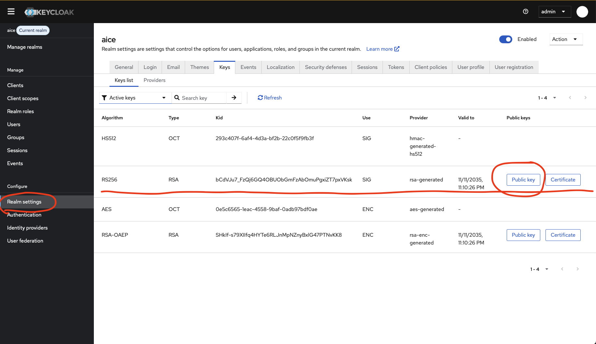

# EPAM AI/Run&trade; AICE (AI Code Exploration) add-on AWS Deployment Guide

## Prerequisites

Before starting the deployment process, ensure you have the following
prerequisites in place:

- **AI/Run&trade; Platform**: Ensure that the AI/Run&trade; Platform is already
  installed and operational in your AWS environment
- **Additional Resources**: Make sure you have the necessary resources allocated
  for AICE (AI Code Exploration) add-on, including compute, storage, and networking resources in your
  AWS environment

**⚠️ Warning:** Resources managed by Terraform are kept in sync with its state.
**Manual edits made directly in the cloud will be undone.** For example, changes
made to the [security group](../../../README.md#71-create-new-security-group))
will be undone on the next `terraform.sh` run. Therefore, after executing the
script, it is recommended to reapply these changes to ensure the configuration
aligns with your desired state.

## AICE Components Overview

<details>
<summary> Expand the section to review all required AI/Run AICE components:</summary>

| Component Name              | Image                                | Description                                                                                                                                                                                                                                                           |
|-----------------------------|--------------------------------------|-----------------------------------------------------------------------------------------------------------------------------------------------------------------------------------------------------------------------------------------------------------------------|
| code-exploration-ui         | aice/code-exploration-ui             | Frontend UI application for code exploration, built with React and served via Nginx. Provides the web interface for users to interact with the AICE system.                                                                                                           |
| code-analysis-datasource    | aice/code-analysis-datasource:latest | Service responsible for parsing and analyzing source code. Exposes APIs for code analysis and provides data to the main API service. Uses LSP implementations and ANTLR for code parsing and semantic analysis.                                                       |
| code-exploration-api        | aice/code-exploration-api            | Main backend API service that handles requests from the UI. Manages the code knowledge graph, interacts with Neo4j, Elasticsearch, and LLM providers to deliver code exploration capabilities. Implements hexagonal architecture for maintainability and scalability. |
| code-exploration-api-worker | aice/code-exploration-api            | Background worker process for the API service that handles asynchronous tasks such as LLM processing. Uses the same image as the API service but runs with a different command.                                                                                       |

</details>

## Third-Party Components

<details>
<summary> Expand the section to review all required 3d party components:</summary>

| Component Name | Image                                                | Description                                                                                                                                                               |
|----------------|------------------------------------------------------|---------------------------------------------------------------------------------------------------------------------------------------------------------------------------|
| neo4j          | neo4j:5.26.3                                         | Graph database used to store and query the code knowledge graph. Configured with APOC and Graph Data Science plugins for advanced graph operations.                       |
| elasticsearch  | docker.elastic.co/elasticsearch/elasticsearch:8.18.1 | Search engine used for full-text searching of code and related metadata. Provides powerful search capabilities across the codebase.                                       |
| redis          | redis:latest                                         | In-memory data store used for caching, session management, and as a message broker for the task queue system. Facilitates communication between API and worker processes. |

</details>

## Container Resource Requirements

<details>
  <summary><strong>Click to expand resource requirements table</strong></summary>

  <table>
    <thead>
      <tr>
        <th>Component Name</th>
        <th>Replicas</th>
        <th>Memory (RAM)</th>
        <th>CPU (cores)</th>
        <th>Storage (EBS)</th>
      </tr>
    </thead>
    <tbody>
      <tr>
        <td>code-exploration-ui</td>
        <td>1</td>
        <td>256Mi</td>
        <td>0.1</td>
        <td>2Gi</td>
      </tr>
      <tr>
        <td>code-analysis-datasource</td>
        <td>1</td>
        <td>4Gi</td>
        <td>2.0</td>
        <td>10Gi</td>            
      </tr>
      <tr>
        <td>code-exploration-api</td>
        <td>1</td>
        <td>4Gi</td>
        <td>2.0</td>
        <td>10Gi</td>
      </tr>
      <tr>
        <td>code-exploration-api-worker</td>
        <td>1</td>
        <td>4Gi</td>
        <td>2.0</td>
        <td>10Gi</td>
      </tr>
      <tr>
        <td>neo4j</td>
        <td>1</td>
        <td>10Gi</td>
        <td>2.0</td>
        <td>50Gi</td>
      </tr>
      <tr>
        <td>elasticsearch</td>
        <td>1</td>
        <td>8Gi</td>
        <td>2.0</td>
        <td>50Gi + 2Gi</td>        
      </tr>    
      <tr>
        <td>redis</td>
        <td>1</td>
        <td>2Gi</td>
        <td>0.5</td>
        <td>8Gi</td>
      </tr>     
    </tbody>
  </table>
</details>

## Codemie Additional Setup

In order to deploy **AICE (AI Code Exploration) add-on** you need to follow additional steps after
platform is installed.

### Add additional resources

Add more nodes for your Kubernetes cluster by changing configuration
in the [deployment.conf](../../terraform-scripts/deployment.conf).

For example, instance type `c5.2xlarge` has `8 vCPUs` and `16 GB RAM`. That
means you need add at least `4` to `TF_VAR_demand_max_nodes_count` and
`TF_VAR_demand_desired_nodes_count`.

> You need to re-run [terraform.sh](../../terraform-scripts/terraform.sh) in
> order to apply new changes.

### Add additional configuration to codemie api

Uncomment the AICE configuration section in the [values-aws.yaml](../../helm-scripts/codemie-api/values-aws.yaml) file and apply the changes.

# EPAM AI/Run™ AICE (AI Code Exploration) Components Deployment

## Overview

This section describes the process of the main EPAM AI/Run™ AICE (AI Code Exploration) components deployment to the AWS
EKS cluster.

## Configuration Preparation

As an initial step, gather all relevant details and populate the configuration
file [deployment.conf](deployment.conf)

<table>
    <thead>
      <tr>
        <th>Variable name</th>
        <th>Description</th>
        <th>How to obtain</th>
      </tr>
    </thead>
    <tbody>
      <tr>
        <td>IMAGE_REPOSITORY</td>
        <td>AWS ECR repository link</td>
        <td>Will be visible on EPAM AI/Run™ for AWS Migration and Modernization Marketplace page</td>
      </tr>
<tr>
        <td>CODE_EXPLORATION_API_VERSION</td>
        <td>Code Exploration API version</td>
        <td>Can be chosen on EPAM AI/Run™ for AWS Migration and Modernization Marketplace page</td>
      </tr>
<tr>
        <td>CODE_EXPLORATION_UI_VERSION</td>
        <td>Code Exploration UI version</td>
        <td>Can be chosen on EPAM AI/Run™ for AWS Migration and Modernization Marketplace page</td>
      </tr>
<tr>
        <td>CODE_ANALYSIS_DATASOURCE_VERSION</td>
        <td>Code Analysis Datasource version</td>
        <td>Can be chosen on EPAM AI/Run™ for AWS Migration and Modernization Marketplace page</td>
      </tr>
<tr>
        <td>DOMAIN_NAME</td>
        <td>Available wildcard DNS hosted zone in Route53</td>
        <td>The value should be taken from the Route 53 hosted zone created in the AI/Run™ Platform installation steps</td>
      </tr>
<tr>
        <td>LLM_AWS_REGION_NAME</td>
        <td>AWS region name</td>
        <td>Example: us-east-1</td>
      </tr>
<tr>
        <td>LLM_QUALITY_MODEL_NAME</td>
        <td>Explicit model name for highest quality/performance tier </td>
        <td>Use 'Inference profile ID' (Amazon Bedrock -> Cross-region inference), Example: global.anthropic.claude-sonnet-4-5-20250929-v1:0</td>
      </tr>
<tr>
        <td>LLM_BALANCED_MODEL_NAME</td>
        <td>Explicit model name for balanced performance/cost tier</td>
        <td>Use 'Inference profile ID' (Amazon Bedrock -> Cross-region inference), Example: global.anthropic.claude-sonnet-4-20250514-v1:0</td>
      </tr>
<tr>
        <td>LLM_EFFICIENCY_MODEL_NAME</td>
        <td>Explicit model name for fastest/lowest cost tier</td>
        <td>Use 'Inference profile ID' (Amazon Bedrock -> Cross-region inference), Example: global.anthropic.claude-sonnet-4-20250514-v1:0</td>
      </tr>
<tr>
        <td>LLM_EMBEDDING_MODEL_NAME</td>
        <td>Explicit embedding model name</td>
        <td>Example: amazon.titan-embed-text-v2:0</td>
      </tr>
<tr>
        <td>JWT_PUBLIC_KEY</td>
        <td>JWT public key for authorization and authentication</td>
        <td>Obtain the public key from the Keycloak Admin Console of your AI/Run™ Platform installation</td>
      </tr>
<tr>
        <td colspan="3">Terraform settings</td>        
      </tr>
<tr>
        <td>TF_VAR_platform_name</td>
        <td>Planform name, usual 'codemie'</td>
        <td>Same value as 'TF_VAR_platform_name' in AI/Run Platform deployment configuration</td>
      </tr>
<tr>
<tr>
        <td>AWS_REGIONS</td>
        <td>AWS region</td>
        <td>Example: us-east-1</td>
      </tr>
<tr>
        <td>BACKEND_BUCKET_NAME</td>
        <td>S3 bucket name that uses for Terraform state synchronization</td>
        <td>AI/Run™ Platform installation provides this value under the 'Terraform state will be stored in'</td>
      </tr>
<tr>
        <td>BACKEND_LOCK_DYNAMODB_TABLE</td>
        <td>Lock DynamoDB Table</td>
        <td>AI/Run™ Platform installation provides this value under the 'Terraform state will be stored in'</td>
      </tr>
<tr>
        <td>AWS_DEPLOYER_ROLE_ARN</td>
        <td>IAM Deployer role ARN</td>
        <td>AI/Run™ Platform installation provides this value under the 'Following role will be used for env creation:'</td>
      </tr>
<tr>
        <td>EKS_AWS_ROLE_ARN</td>
        <td>The ARN of the IAM role that have access to the AWS KMS key and AWS Bedrock</td>
        <td>Value of EKS_AWS_ROLE_ARN parameter in platform deployment_outputs.env</td>
      </tr>

</tbody>
</table>


### How to obtain the public key from Keycloak Admin Console</summary>

- Log in to the Keycloak Admin Console.
- Select your realm from the left sidebar.
- Go to **Realm Settings**.
- Open the **Keys** tab.
- Find the key with the algorithm (e.g., RS256) used for token signing.
- Click on the key to view its details.
- Copy the **Public Key** value displayed.

Save this public key as a `jwt_public_key.pem` file in the `../helm-scripts` folder and set its path in the `JWT_PUBLIC_KEY` setting in the [deployment.conf](deployment.conf).

⚠️ Don't forget pem headers, example:
```bash
-----BEGIN PUBLIC KEY-----
MIIBIjANBgkqhkiG9w0BAQEFAAOCAQ8AMIIBCgKCAQEAtakdhf8QWTFVjsJb/GteAb91Llz6....
-----END PUBLIC KEY-----
```



[Detailed information how to login into Keycloak](../../../README.md#8-post-installation-configuration)

# There are two options for deploying the system:

## 1. Scripted Components Installation

Use the provided script to deploy all components of the system in one step.

1. Make sure that you are in the `deployment/add-ons/aice` folder.

2. Run the following command if using a Unix-like operating system:
   ```bash
   chmod +x deploy.sh

3. Run the script:
    ```bash
   ./deploy.sh

You can find installation logs in the `../logs` folder.

## 2. Manual Components Installation

Deploy each component separately by following the step-by-step instructions.

⚠️ Important: If the previous step has already been completed, please proceed to skip this step.

<details>
<summary>If you prefer to manually deploy step by step, expand this section for more instructions:</summary>

### 1. Amazon RDS Postgresql installation
[Learn more in the documentation](https://docs.aws.amazon.com/AmazonRDS/latest/UserGuide/CHAP_GettingStarted.CreatingConnecting.PostgreSQL.html)

#### 1.1 Deploy Amazon RDS Postgresql using AWS Console

#### 1.2 Create k8s Secret with Postgresql data:
```bash
kubectl -n aice create secret generic aice-postgresql-secret \
            --from-literal=password="<AWS_RDS_DATABASE_PASSWORD>" \
            --from-literal=user="<AWS_RDS_DATABASE_USER>" \
            --from-literal=host="$<AWS_RDS_HOST>" \
            --from-literal=db="<AWS_RDS_DATABASE_NAME>"
```

### 2. Amazon S3 bucket for Neo4j plugins:

1. Create an S3 bucket with name `aice_neo4j_plugins` using AWS Console
2. Grant `s3:GetObject` and `s3:ListBucket` bucket permissions for:
    - `arn:aws:iam::[current_account_id]:role/[codmie | your planform name]-on-demand-node-group` 
    - `arn:aws:iam::[current_account_id]:role/[codmie | your planform name]-spot-node-group`
3. Upload files from `deployment/add-ons/aice/terraform-scripts/aice-aws-s3-neo4j-plugins/plugins`([plugins](terraform-scripts/aice-aws-s3-neo4j-plugins/plugins)) to the bucket.


### 3. Navigate helm-scripts folder

```bash
  cd ../helm-scripts
```
### 4. Create namespace:
```bash
  kubectl create namespace aice 
```

### 5. Install Redis:

```bash
  helm upgrade --install aice-redis redis/. --namespace aice --values "redis/values.yaml" --wait --timeout 600s --dependency-update
```

### 6. Install Elasticsearch:
```bash
  helm upgrade \
      --install aice-elasticsearch elasticsearch/. \
      --namespace aice \
      --values "elasticsearch/values.yaml" \
      --wait \
      --timeout 600s \
      --dependency-update 
```
### 7. Install Neo4j:
Create s Secret with Neo4j password:
```bash
kubectl -n $namespace create secret generic aice-neo4j-secret \
        --from-literal=username="neo4j" \
        --from-literal=password="<pwd>" \
        --from-literal=auth="neo4j/<pwd>"
```

```bash
  helm upgrade \
      --install aice-neo4j neo4j/. \
      --namespace aice \
      --values "neo4j/values.yaml" \
      --set neo4j.s3.plugins="<Neo4j plugins bucket full name>" \
      --wait \
      --timeout 600s \
      --dependency-update 
```

### 8. Install Code Exploration API:
Modify `code-exploration-api/values.yaml`:
- replace %%IMAGE_REPOSITORY%% to AWS ECR repository link.
- replace %%IMAGE_VERSION%% to proper image version.
- replace %%DOMAIN%% to proper domain name.
- replace "%%LLM_QUALITY_MODEL_NAME%%" to proper value.
- replace "%%LLM_BALANCED_MODEL_NAME%%" to proper value.
- replace "%%LLM_EFFICIENCY_MODEL_NAME%%" to proper value.
- replace "%%LLM_EMBEDDING_MODEL_NAME%%" to proper value.
- replace "%%LLM_AWS_REGION_NAME%%" to proper value.

Install:
```bash
helm upgrade \
      --install aice-code-exploration-api code-exploration-api/. \
      --namespace aice \
      --values "code-exploration-api/values.yaml" \
      --set serviceAccount.iamRoleArn="<EKS_AWS_ROLE_ARN>" \
      --set-file jwtPublicKey.keyData="<jwt_public_key>" \
      --wait \
      --timeout 600s \
      --dependency-update
```
⚠️ replace <EKS_AWS_ROLE_ARN> and <jwt_public_key> to proper values

### 9. Install Code Analysis Datasource:
Modify `code-analysis-datasource/values.yaml`:
- replace %%IMAGE_REPOSITORY%% to AWS ECR repository link.
- replace %%IMAGE_VERSION%% to proper image version.
- replace %%DOMAIN%% to proper domain name.

Install:
```bash
helm upgrade \
      --install aice-code-analysis-datasource code-analysis-datasource/. \
      --namespace aice \
      --values "code-analysis-datasource/values.yaml" \
      --wait \
      --timeout 600s \
      --dependency-update
```

### 10. Install Code Exploration UI:
Modify `code-exploration-ui/values.yaml`:
- replace %%IMAGE_REPOSITORY%% to AWS ECR repository link.
- replace %%IMAGE_VERSION%% to proper image version.
- replace %%DOMAIN%% to proper domain name.

Install:
```bash
helm upgrade \
      --install aice-code-exploration-ui code-exploration-ui/. \
      --namespace aice \
      --values "code-exploration-ui/values.yaml" \
      --wait \
      --timeout 600s \
      --dependency-update
```

</details>

# 3. Post-installation configuration

This section is required to enable the use of AICE in EPAM AI/Run™ for AWS. 
Specifically, it explains how to add elements to the Datasource Type and External Tools in the assistant settings.

1. Login into EPAM AI/Run™ for AWS application with admin
2. Open Add Providers page (Profile -> Settings -> Providers management -> Add Provider)
3. Put next value into field
<details>

```
{
  "service_location_url": "http://aice-code-exploration-api.aice.svc.cluster.local:8080/api/v1",
  "name": "CodeExplorationServiceProvider",
  "configuration": {
    "auth_type": "Bearer"
  },
  "provided_toolkits": [
    {
      "toolkit_id": "7aad8ff1-c015-4a62-901e-ab1fdf5d7deb",
      "name": "CodeExplorationToolkit",
      "description": "This ToolKit provides tools for managing datasources, including creating, updating, retrieving, and deleting datasources.",
      "toolkit_config": {
        "type": "Code Exploration Datasource Management Configuration",
        "description": "Configuration model for the Datasource Management Toolkit.",
        "parameters": {
          "datasource_id": {
            "description": "Unique identifier for the datasource",
            "type": "UUID",
            "required": true,
            "enum": null,
            "example": null,
            "title": null
          },
          "graphdb_password": {
            "description": "Password for the AI/Run Code Analysis Datasources graph database",
            "type": "String",
            "required": false,
            "enum": null,
            "example": null,
            "title": null
          },
          "graphdb_username": {
            "description": "Username for the AI/Run Code Analysis Datasources graph database",
            "type": "String",
            "required": false,
            "enum": null,
            "example": null,
            "title": null
          },
          "graphdb_tenant_url": {
            "description": "Neo4j connection URL for the AI/Run Code Analysis Datasources graph database",
            "type": "URL",
            "required": false,
            "enum": null,
            "example": null,
            "title": null
          },
          "code_analysis_service_location_url": {
            "description": "API URL for AI/Run code analysis service provider",
            "type": "URL",
            "required": true,
            "enum": null,
            "example": null,
            "title": null
          }
        }
      },
      "provided_tools": [
        {
          "name": "delete_datasource",
          "description": "Deletes an existing Code Exploration Datasource.",
          "args_schema": {},
          "tool_metadata": {
            "tool_type": "stateful",
            "tool_purpose": "life_cycle_management",
            "tool_action_type": "remove"
          },
          "tool_result_type": "Json",
          "sync_invocation_supported": false,
          "async_invocation_supported": true
        },
        {
          "name": "summaries_search",
          "description": "Retrieves relevant nodes matching the specified query from the graph database.",
          "args_schema": {
            "query": {
              "type": "String",
              "required": true,
              "description": "The query to search relevant nodes by node summaries.",
              "enum": null,
              "title": null,
              "example": null
            },
            "scoped_nodes": {
              "type": "List",
              "required": false,
              "description": "List of node IDs to limit the search scope to.",
              "enum": null,
              "title": null,
              "example": null
            },
            "excluded_nodes": {
              "type": "List",
              "required": false,
              "description": "Currently not supported. Skip it.",
              "enum": null,
              "title": null,
              "example": null
            }
          },
          "tool_metadata": {
            "tool_type": "stateful",
            "tool_purpose": "data_retrieval",
            "tool_action_type": "read"
          },
          "tool_result_type": "Json",
          "sync_invocation_supported": true,
          "async_invocation_supported": false
        },
        {
          "name": "workspace_tree_exploration",
          "description": "Explores the file and directory tree structure for repositories in a workspace, providing hierarchical views of the codebase organization.",
          "args_schema": {
            "max_depth": {
              "type": "String",
              "required": false,
              "description": "Maximum depth of tree traversal to prevent overly deep structures. Default is 10.",
              "enum": null,
              "title": null,
              "example": null
            },
            "repository_id": {
              "type": "String",
              "required": false,
              "description": "Specific repository node ID (UUID) to get tree for. If not provided, gets trees for all repositories in all workspaces.",
              "enum": null,
              "title": null,
              "example": null
            }
          },
          "tool_metadata": {
            "tool_type": "stateful",
            "tool_purpose": "data_retrieval",
            "tool_action_type": "read"
          },
          "tool_result_type": "Json",
          "sync_invocation_supported": true,
          "async_invocation_supported": false
        },
        {
          "name": "find_nodes_by_name",
          "description": "Searches for a relevant node in the graph database by its name, enabling quick access to specific code components.",
          "args_schema": {
            "name": {
              "type": "String",
              "required": true,
              "description": "Name of the node to search for.",
              "enum": null,
              "title": null,
              "example": null
            }
          },
          "tool_metadata": {
            "tool_type": "stateful",
            "tool_purpose": "data_retrieval",
            "tool_action_type": "read"
          },
          "tool_result_type": "Json",
          "sync_invocation_supported": true,
          "async_invocation_supported": false
        },
        {
          "name": "get_datasource",
          "description": "Retrieves details of a specific Code Exploration Datasource.",
          "args_schema": {},
          "tool_metadata": {
            "tool_type": "stateful",
            "tool_purpose": "data_retrieval",
            "tool_action_type": "read"
          },
          "tool_result_type": "Json",
          "sync_invocation_supported": true,
          "async_invocation_supported": false
        },
        {
          "name": "create_datasource",
          "description": "Creates a new AI/Run Code Exploration Datasource with specified name, description, and the list of the Code Analysis Datasource ids.",
          "args_schema": {
            "name": {
              "type": "String",
              "required": true,
              "description": "Name of the Code Exploration Datasource",
              "enum": null,
              "title": null,
              "example": null
            },
            "description": {
              "type": "String",
              "required": true,
              "description": "Description of the Code Exploration Datasource",
              "enum": null,
              "title": null,
              "example": null
            },
            "code_analysis_datasource_ids": {
              "type": "List",
              "required": true,
              "description": "List of Code Analysis Datasources",
              "enum": null,
              "title": null,
              "example": null
            }
          },
          "tool_metadata": {
            "tool_type": "stateful",
            "tool_purpose": "life_cycle_management",
            "tool_action_type": "create"
          },
          "tool_result_type": "Json",
          "sync_invocation_supported": false,
          "async_invocation_supported": true
        },
        {
          "name": "graph_search",
          "description": "Retrieves relevant nodes matching the specified query from the graph database, allowing for complex queries and exploration of code relationships.",
          "args_schema": {
            "query": {
              "type": "String",
              "required": true,
              "description": "The query to search relevant nodes in the graph database.",
              "enum": null,
              "title": null,
              "example": null
            },
            "scoped_nodes": {
              "type": "List",
              "required": false,
              "description": "List of node IDs to limit the search scope to.",
              "enum": null,
              "title": null,
              "example": null
            },
            "excluded_nodes": {
              "type": "List",
              "required": false,
              "description": "Currently not supported. Skip it.",
              "enum": null,
              "title": null,
              "example": null
            }
          },
          "tool_metadata": {
            "tool_type": "stateful",
            "tool_purpose": "data_retrieval",
            "tool_action_type": "read"
          },
          "tool_result_type": "Json",
          "sync_invocation_supported": true,
          "async_invocation_supported": false
        },
        {
          "name": "get_nodes_by_ids",
          "description": "Fetches detailed information about specific nodes in the graph database using their unique identifiers, enabling targeted exploration of code components.",
          "args_schema": {
            "ids": {
              "type": "List",
              "required": true,
              "description": "List of UUIDs of nodes to retrieve.",
              "enum": null,
              "title": null,
              "example": null
            }
          },
          "tool_metadata": {
            "tool_type": "stateful",
            "tool_purpose": "data_retrieval",
            "tool_action_type": "read"
          },
          "tool_result_type": "Json",
          "sync_invocation_supported": true,
          "async_invocation_supported": false
        },
        {
          "name": "get_graph_data_model",
          "description": "Returns a detailed description of the graph database structure, including layers, labels, relationships, and their semantics.",
          "args_schema": {},
          "tool_metadata": {
            "tool_type": "stateful",
            "tool_purpose": "data_retrieval",
            "tool_action_type": "read"
          },
          "tool_result_type": "Text",
          "sync_invocation_supported": true,
          "async_invocation_supported": false
        },
        {
          "name": "reindex_datasource",
          "description": "Updates an existing Code Exploration Datasource by re-indexing the associated Git repository to incorporate the latest changes and maintain synchronization with the current codebase.",
          "args_schema": {},
          "tool_metadata": {
            "tool_type": "stateful",
            "tool_purpose": "life_cycle_management",
            "tool_action_type": "modify"
          },
          "tool_result_type": "Json",
          "sync_invocation_supported": false,
          "async_invocation_supported": true
        }
      ],
      "toolkit_metadata": {
        "life_cycle_id": "datasource_id",
        "managed_fields": {
          "code_analysis_service_location_url": "https://codemie.%%DOMAIN%%/aice/datasource/api/v1/"
        }
      }
    }
  ]
}
```
</details>

4. Update the code_analysis_service_location_url property with the following value, replacing the %%DOMAIN%% placeholder with the value of TF_VAR_platform_domain_name from the deployment/terraform-scripts/deployment.conf file:
```
      "toolkit_metadata": {
        "life_cycle_id": "datasource_id",
        "managed_fields": {
          "code_analysis_service_location_url": "https://codemie.%%DOMAIN%%/aice/datasource/api/v1/"
        }
      }
```
5. Save new provider 
6. Open Add Providers page
7. Put next value into field
<details>

```
{
  "service_location_url": "http://aice-code-analysis-datasource.aice.svc.cluster.local:8001/api/v1/",
  "name": "CodeAnalysisServiceProvider",
  "configuration": {
    "auth_type": "Bearer"
  },
  "provided_toolkits": [
    {
      "toolkit_id": "1eb9de12-b8fa-4bb8-a3a4-1834519e8f3c",
      "name": "CodeAnalysisToolkit",
      "description": "This ToolKit provides tools for indexing the source code of provided repository and set of methods to get insights of the code and code snippets.",
      "toolkit_config": {
        "type": "Code Analysis Datasource Configuration",
        "description": "Configuration for this toolkit",
        "parameters": {
          "branch": {
            "description": "Branch to checkout, defaults to master",
            "type": "String",
            "required": false,
            "enum": null,
            "example": null,
            "title": null
          },
          "api_url": {
            "description": "Link to git repository with codebase for analysis",
            "type": "URL",
            "required": true,
            "enum": null,
            "example": null,
            "title": null
          },
          "access_token": {
            "description": "Git access token with appropriate scopes for repository read access",
            "type": "Secret",
            "required": true,
            "enum": null,
            "example": null,
            "title": null
          },
          "datasource_id": {
            "description": "Unique identifier for the datasource",
            "type": "UUID",
            "required": true,
            "enum": null,
            "example": null,
            "title": null
          }
        }
      },
      "provided_tools": [
        {
          "name": "get_outgoing_dependencies",
          "description": "Analyzes and returns information about external dependencies and imports used by specified files or code components, helping to understand code relationships and dependency chains.",
          "args_schema": {
            "end_line": {
              "type": "Number",
              "required": false,
              "description": "Ending line number to get outgoing dependencies till, defaults to end of file",
              "enum": null,
              "title": null,
              "example": null
            },
            "file_path": {
              "type": "String",
              "required": true,
              "description": "Path of the file to get outgoing dependencies from",
              "enum": null,
              "title": null,
              "example": null
            },
            "start_line": {
              "type": "Number",
              "required": false,
              "description": "Starting line number to get outgoing dependencies from, defaults to 1",
              "enum": null,
              "title": null,
              "example": null
            }
          },
          "tool_metadata": {
            "tool_type": "stateful",
            "tool_purpose": "data_retrieval",
            "tool_action_type": "read"
          },
          "tool_result_type": "Json",
          "sync_invocation_supported": true,
          "async_invocation_supported": false
        },
        {
          "name": "create_datasource",
          "description": "Creates a new datasource by indexing a Git repository for code analysis. The indexing process extracts code structure, dependencies, and other metadata to enable subsequent queries.",
          "args_schema": {
            "exclude_files": {
              "type": "String",
              "required": false,
              "description": "Comma-separated gitignore-style patterns for files to exclude (e.g., '*.log, tests/, **/build/**'). Applied after include_files.",
              "enum": null,
              "title": null,
              "example": null
            },
            "include_files": {
              "type": "String",
              "required": false,
              "description": "Comma-separated gitignore-style patterns for files to include (e.g., '*.py, **/*.js'). If specified, only matching files are kept.",
              "enum": null,
              "title": null,
              "example": null
            },
            "datasource_root": {
              "type": "String",
              "required": true,
              "description": "Root directory in the datasource to be analyzed",
              "enum": null,
              "title": null,
              "example": null
            }
          },
          "tool_metadata": {
            "tool_type": "stateful",
            "tool_purpose": "life_cycle_management",
            "tool_action_type": "create"
          },
          "tool_result_type": "Json",
          "sync_invocation_supported": false,
          "async_invocation_supported": true
        },
        {
          "name": "get_files_list",
          "description": "Retrieves a list of files and directories within the specified path in the indexed repository, showing file names and types for easy reference.",
          "args_schema": {
            "path": {
              "type": "String",
              "required": true,
              "description": "Relative path within the repository to list files from",
              "enum": null,
              "title": null,
              "example": null
            },
            "limit": {
              "type": "Integer",
              "required": false,
              "description": "Maximum number of files to include in the list, defaults to all files",
              "enum": null,
              "title": null,
              "example": null
            },
            "recursive": {
              "type": "Number",
              "required": false,
              "description": "Flag to include files recursively, defaults to false",
              "enum": null,
              "title": null,
              "example": null
            }
          },
          "tool_metadata": {
            "tool_type": "stateful",
            "tool_purpose": "data_retrieval",
            "tool_action_type": "read"
          },
          "tool_result_type": "Json",
          "sync_invocation_supported": true,
          "async_invocation_supported": false
        },
        {
          "name": "get_trimmed_code",
          "description": "Retrieves a simplified version of code from specified files with non-essential elements (like comments and some whitespace) removed to focus on the core functionality.",
          "args_schema": {
            "file_path": {
              "type": "String",
              "required": true,
              "description": "Path of the file to extract trimmed code from",
              "enum": null,
              "title": null,
              "example": null
            },
            "exclude_private": {
              "type": "Boolean",
              "required": false,
              "description": "Flag to exclude private members from the trimmed code, defaults to true",
              "enum": null,
              "title": null,
              "example": null
            },
            "show_line_numbers": {
              "type": "Boolean",
              "required": false,
              "description": "Flag to include line numbers in the trimmed code, defaults to false",
              "enum": null,
              "title": null,
              "example": null
            }
          },
          "tool_metadata": {
            "tool_type": "stateful",
            "tool_purpose": "data_retrieval",
            "tool_action_type": "read"
          },
          "tool_result_type": "String",
          "sync_invocation_supported": true,
          "async_invocation_supported": false
        },
        {
          "name": "reindex_datasource",
          "description": "Updates an existing datasource by re-indexing the associated Git repository to incorporate the latest changes and maintain synchronization with the current codebase.",
          "args_schema": {},
          "tool_metadata": {
            "tool_type": "stateful",
            "tool_purpose": "life_cycle_management",
            "tool_action_type": "modify"
          },
          "tool_result_type": "Json",
          "sync_invocation_supported": false,
          "async_invocation_supported": true
        },
        {
          "name": "get_datasource",
          "description": "Get information about an existing datasource.",
          "args_schema": {},
          "tool_metadata": {
            "tool_type": "stateful",
            "tool_purpose": "data_retrieval",
            "tool_action_type": "read"
          },
          "tool_result_type": "Json",
          "sync_invocation_supported": true,
          "async_invocation_supported": false
        },
        {
          "name": "delete_datasource",
          "description": "Removes an existing datasource and all its indexed data from the system, freeing up resources and cleaning up stale references.",
          "args_schema": {},
          "tool_metadata": {
            "tool_type": "stateful",
            "tool_purpose": "life_cycle_management",
            "tool_action_type": "remove"
          },
          "tool_result_type": "Json",
          "sync_invocation_supported": false,
          "async_invocation_supported": true
        },
        {
          "name": "get_files_tree",
          "description": "Retrieves a hierarchical representation of the file system structure of the indexed repository, showing directories and files in a tree format for easy navigation.",
          "args_schema": {
            "path": {
              "type": "String",
              "required": true,
              "description": "Relative path within the repository to start the tree structure from",
              "enum": null,
              "title": null,
              "example": null
            },
            "level": {
              "type": "Number",
              "required": false,
              "description": "Maximum depth of the tree structure, defaults to full depth",
              "enum": null,
              "title": null,
              "example": null
            },
            "limit": {
              "type": "Number",
              "required": false,
              "description": "Maximum number of files to include in the tree structure, defaults to all files",
              "enum": null,
              "title": null,
              "example": null
            }
          },
          "tool_metadata": {
            "tool_type": "stateful",
            "tool_purpose": "data_retrieval",
            "tool_action_type": "read"
          },
          "tool_result_type": "String",
          "sync_invocation_supported": true,
          "async_invocation_supported": false
        },
        {
          "name": "get_metadata",
          "description": "Retrieves metadata information about specified files in the indexed repository, including file size, line count, and other relevant details.",
          "args_schema": {
            "file_path": {
              "type": "String",
              "required": true,
              "description": "Relative path to the file to get metadata for",
              "enum": null,
              "title": null,
              "example": null
            }
          },
          "tool_metadata": {
            "tool_type": "stateful",
            "tool_purpose": "data_retrieval",
            "tool_action_type": "read"
          },
          "tool_result_type": "String",
          "sync_invocation_supported": true,
          "async_invocation_supported": false
        },
        {
          "name": "get_code_members",
          "description": "Get the code members (functions, classes, etc.) from a specific file.",
          "args_schema": {
            "end_line": {
              "type": "Number",
              "required": false,
              "description": "Ending line number to extract code members till, defaults to end of file",
              "enum": null,
              "title": null,
              "example": null
            },
            "file_path": {
              "type": "String",
              "required": true,
              "description": "Path of the file to extract code members from",
              "enum": null,
              "title": null,
              "example": null
            },
            "start_line": {
              "type": "Number",
              "required": false,
              "description": "Starting line number to extract code members from, defaults to 1",
              "enum": null,
              "title": null,
              "example": null
            }
          },
          "tool_metadata": {
            "tool_type": "stateful",
            "tool_purpose": "data_retrieval",
            "tool_action_type": "read"
          },
          "tool_result_type": "Json",
          "sync_invocation_supported": true,
          "async_invocation_supported": false
        },
        {
          "name": "unload_datasource",
          "description": "Unloads (detaches) an existing datasource from in-memory cache without deleting persisted metadata or files. Use this to free RAM when a datasource is idle; it can be lazily reloaded later on demand.",
          "args_schema": {},
          "tool_metadata": {
            "tool_type": "stateful",
            "tool_purpose": "life_cycle_management",
            "tool_action_type": "modify"
          },
          "tool_result_type": "Json",
          "sync_invocation_supported": false,
          "async_invocation_supported": true
        },
        {
          "name": "get_code",
          "description": "Fetches the complete, unmodified source code of specified files or code segments from the indexed repository, preserving all original formatting and comments.",
          "args_schema": {
            "end_line": {
              "type": "Number",
              "required": false,
              "description": "Ending line number to extract code till, defaults to end of file",
              "enum": null,
              "title": null,
              "example": null
            },
            "file_path": {
              "type": "String",
              "required": true,
              "description": "Path of the file to extract code from",
              "enum": null,
              "title": null,
              "example": null
            },
            "start_line": {
              "type": "Integer",
              "required": false,
              "description": "Starting line number to extract code from, defaults to 1",
              "enum": null,
              "title": null,
              "example": null
            },
            "show_line_numbers": {
              "type": "Number",
              "required": false,
              "description": "Flag to include line numbers in the code, defaults to false",
              "enum": null,
              "title": null,
              "example": null
            }
          },
          "tool_metadata": {
            "tool_type": "stateful",
            "tool_purpose": "data_retrieval",
            "tool_action_type": "read"
          },
          "tool_result_type": "String",
          "sync_invocation_supported": true,
          "async_invocation_supported": false
        }
      ],
      "toolkit_metadata": {
        "life_cycle_id": "datasource_id",
        "managed_fields": null
      }
    }
  ]
}

```
</details>

8. Save new provider
9. Go to Create New DataSource Page
10. Verify that the new items appears in the "Choose Datasource Type" dropdown list.
11. Go to Create Assistant page
12. Verify that the new items appears in the External tools tab 