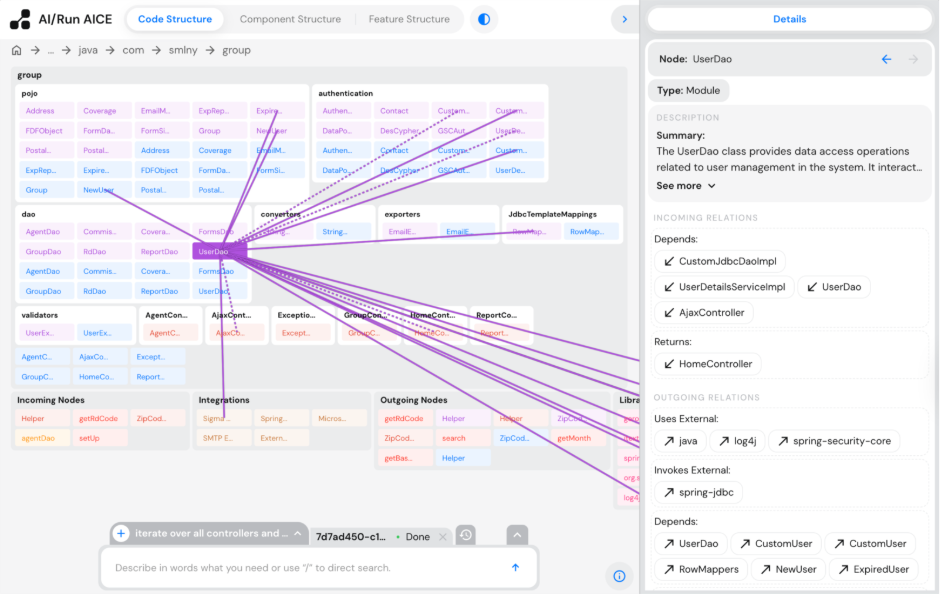
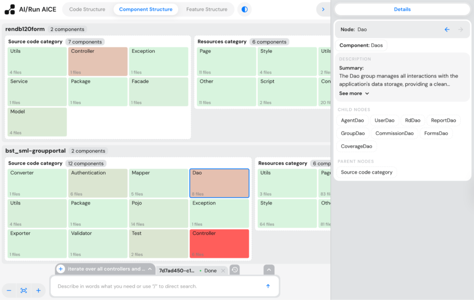
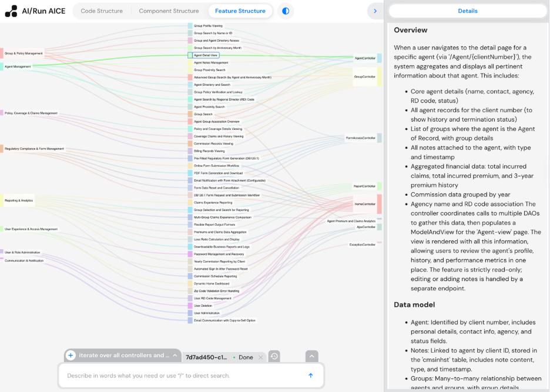
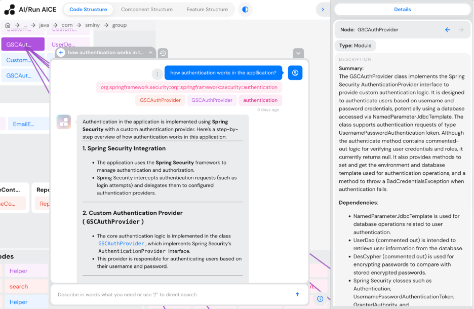
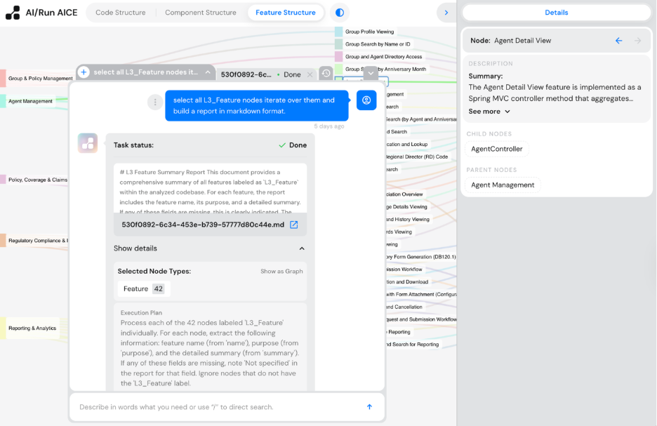
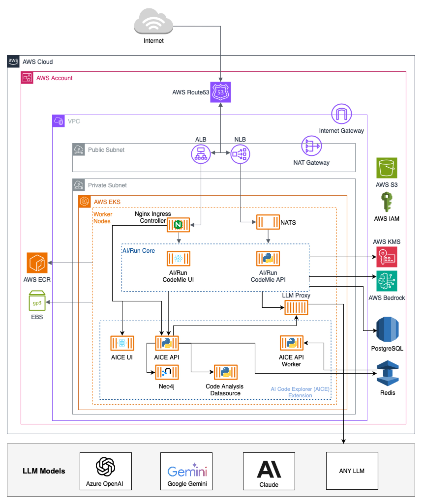

# AI/Run AICE

AI-powered web-based tool for code analysis and exploration

CONTENTS

- [Overview](#overview)
- [Getting Started with AICE](#Getting-Started-with-AICE)
- [Capabilities](#Capabilities)
- [Architecture and Technology Stack](#Architecture-and-Technology-Stack)
- [How it works](#How-it-works)
- [Deployment](#Deployment)

## Overview
AICE (AI Code Exploration) is an advanced code analysis and exploration solution within the EPAM AI/Run platform, integrated into CodeMie as an Extension and available as a Graph Datasource for CodeMie Assistants, and as a UI App for end users. 
AICE transforms source code into a comprehensive Knowledge Graph using a multi-level Unified Graph Data Model(1). It combines static code analysis with semantic analysis powered by Large Language Models (LLMs) to create a rich, interconnected representation of your codebase, enabling deeper exploration of code dependencies, structures, and relationships. 

## Key Features

- Knowledge Graph Construction: Converts source code into a navigable, multi-level graph representation with hierarchical abstraction layers 
- Multi-language Support: Analyzes codebases in Java, C++, C#, JavaScript, and TypeScript 
- AI-Powered Semantic Analysis: Enriches static analysis with LLM-generated documentation, component categorization, and business functionality mapping 
- Interactive Exploration: Navigate codebases through three distinct views: Code Structure, Component Structure, and Feature Structure 
- Conversational Assistant: Intelligent chat interface that processes queries through adaptive workflows, from simple Q&A to complex batch exploration tasks

# Getting Started with AICE

## AI/Run Platform

Access AICE through the [CodeMie Preview](https://codemie-preview.lab.epam.com) environment.

EPAM AI/Run™ CodeMie, see [AWS Marketplace Deployment guide](https://github.com/epam/EPAM-AI-RUN-Marketplace/blob/aitm-docs/README.md)

# Capabilities

## 1. Static Code Analysis

The AI/Run AICE solution employs comprehensive static code analysis as the foundation for intelligent code exploration. 

Key capabilities include code parsing through AST generation, intra and inter-repository dependency resolution, external library usage detection, and code trimming for focused analysis.

These capabilities are exposed via a code analysis datasource module and can be plugged into AI/Run Codemie agents or custom agentic workflows without using the entire AICE package. 

### Capability Maturity Matrix

| Capability                        | Java | C++ | C# | JS | TS |
|-----------------------------------|------|-----|----|----|----|
| Intra-Repository Dependency Resolution | +    | +/- | +/-| +/-| +/-|
| Inter-Repository Dependency Resolution | +/-  | -   | -  | -  | -  |
| External Library Detection & Extraction | +/-  | +/- | +/-| +/-| +  |
| Code Trimming                     | +    | +   | +  | +  | +  |
| Language Construct Parsing (AST)  | +    | +   | +  | +  | +  |
| Fast Indexing for Large Codebases | +    | +   | +  | -  | -  |
| Multi-Language Repository Analysis| +    | +   | +  | +  | +  |
| ANTLR Support                     | +    | +   | +  | +  | +  |
| JOERN Support                     | +    | +   | +  | -  | -  |
| LSP Support                       | + (ccls) | - | - | - | - |
| Extension for Framework-Specific Analysis | N/A | N/A | N/A | - (Angular 1) | N/A |

### Maturity Levels
- **+**: Full feature support with comprehensive implementation (High)
- **+/-**: Good support with some limitations or gaps (Moderate)
- **N/A**: Not supported

## 2. Semantic Analysis

The AI/Run AICE solution provides advanced GenAI-powered code analysis capabilities that go beyond traditional static analysis. Building on static code analysis results, the system employs a multi-stage pipeline that leverages LLMs to create a comprehensive Knowledge Graph and generate the following insights:

**Code Documentation Using a Bottom-up Summarization Approach** 
- **Component-level summaries**: Automatically generates comprehensive summaries for each component in the code graph (methods, classes, packages, etc.) 
- **Package and folder summaries**: Creates high-level overviews of entire packages, folders, and repositories 
- **External library documentation**: Produces summaries for external libraries and their usage patterns 
- **Integration summaries**: Documents external integrations and their purposes

Intelligent Component Categorization 
The system employs AI-driven taxonomy to organize code components: 
Component classification: Groups classes, modules, and resources into logical components 
Service identification: Automatically identifies component types such as Controllers, Services, Providers, and other architectural patterns 
Hierarchical organization: Creates multi-level categorization (Repository → Category Type → Group → Components) 

**Integration Analysis**
Advanced AI analysis identifies and categorizes system integrations:

- **External integration detection**: Identifies connections to databases, third-party systems, and external APIs (CRMs, etc.) 
- **Internal integration mapping (Not Yet Supported)**: Maps dependencies between distributed components within the system 
- **Integration pattern recognition (Not Yet Supported)**: Classifies integration types and communication patterns 

**Functionality Reconstruction** 
The platform's most advanced capability transforms code analysis into business understanding:

- **Code invocation chain analysis**: Traces execution paths and summarizes them into business features 
- **Feature grouping**: Clusters related features into functional domains using LLM 
- **Business context mapping**: Connects technical implementations to business functionality 
- **Domain summary generation**: Creates comprehensive summaries for each identified functional domain 

## 3. Interactive Code Exploration & Visualization

The constructed Knowledge Graph can be viewed and navigated through an interactive UI that provides three distinct perspectives:

### Code Structure View

Presents a hierarchical representation of your application's source code and external dependencies. Navigate through packages, classes, and methods to understand code organization, explore dependencies between code components, and identify integrations with external systems and libraries.

*Figure 1. Code Structure View for Java-based Web Application.*

### Component Structure View 

Classifies code into logical component groups based on purpose (Services, Handlers, Repositories, Utilities). Features a heat map visualization that highlights component dependencies—green indicates low dependency, red signals high dependency.

*Figure 2. Component Structure View for Java-Based Web Applications.*

### Feature Structure View 
Provides a functional perspective using Sankey diagrams to illustrate how high-level functional domains break down into individual features and their corresponding code entry points. Enables tracing features directly back to source code.

*Figure 3. Feature Structure View for Java-Based Web Application.*

Additionally, the graph data is exposed via a code exploration datasource, enabling integration with AI/Run Codemie agents and custom workflows. 

## 4. Conversational AI Assistant & Task Processing

AICE features a conversational interface that transforms code exploration into natural language interactions with the Knowledge Graph, supporting both basic queries and advanced AI task processing.

### Chat Capabilities

Users can explore codebases through two primary approaches: 

- **Manual selection**: Search or navigate to specific graph nodes using UI and target them for focused analysis 
- **Intelligent discovery**: Leverage agentic capabilities to select proper tools, vector and graph searches to automatically identify relevant nodes based on the summaries and relationships
- 
Advanced search features include: 
- TypeAhead auto-completion for quick component location 
- Full-text search across code snippets and AI-generated summaries 
- Sophisticated graph querying for exploring entity relationships

*Figure 4. Chat interface with AICE Assistant*

### AI Task Processing 

The system can create long-running tasks to process huge parts of the graph based on user queries through: 
- **Intent recognition**: Automatically understands user goals to select optimal processing strategies 
- **Dynamic scope construction**: Builds targeted analysis boundaries using integrated tools 
- **Strategy selection**: Chooses between map processing or map-reduce approaches based on query complexity 
- **Multi-format export**: Delivers results in CSV and Markdown formats for documentation and further analysis

*Figure 5. Chat interface showing completed AI task.*

This conversational approach makes complex codebase exploration accessible to both technical and non-technical stakeholders, enabling an intuitive understanding of system architecture and functionality.

# Architecture and Technology Stack

*Figure 6. High-level AICE AWS Architecture*

## Components Description

#### Code Exploration UI 
A React TypeScript application featuring interactive Knowledge Graph visualizations through D3.js and Redux Toolkit for state management. It displays data from the Code Exploration API in three distinct visual formats. The application is deployed as a containerized service and embedded in the AI/Run Codemie platform as an App. 

#### Code Exploration API and Workers 
A Python FastAPI microservice with async architecture that provides RESTful endpoints for Knowledge Graph operations, workspace management, and repository analysis. The service features OAuth2/JWT authentication and LangChain Core integration for LLM abstraction. It integrates with the AI/Run Codemie platform as a datasource and operates as a Taskiq worker process using Redis as the message broker. 

#### Code Analysis Datasource 
A multi-language static analysis service supporting Java, C#, TypeScript/JavaScript (via ANTLR parsers), C++ (via LSP/ccls), and advanced analysis through the Joern framework. It provides RESTful endpoints for source code indexing and analysis and is consumed by both the Code Exploration API and AI/Run Codemie platform. 

#### Neo4j Graph Database 
A graph database with APOC, GDS, and DOSERDB plugins that supports Cypher queries and ACID transactions. It stores code entities, relationships, dependency graphs, and AI-generated metadata using a property graph model. 

#### Elasticsearch 
A search engine that provides vector search capabilities across Knowledge Graph entities. It features specialized indices for code content, AI-generated summaries, and metadata. 

#### Redis
An in-memory data store serving multiple purposes: Taskiq message broker, application cache with TTL policies, session storage for authentication, and pub/sub messaging for real-time notifications.

#### PostgreSQL 
A relational database management system that serves as the primary persistent storage for AICE workspace configurations and AI task management. PostgreSQL handles workspace metadata including repository configurations, analysis settings, project and user associations. It also provides reliable storage for long-running AI task persistence, ensuring task state is maintained across system restarts and enabling robust task recovery mechanisms.

## Core Technology Stack

|Component|Framework/Technology|Purpose |
|---------|---------------------|--------|
|Frontend |React v18.3, Redux Toolkit v2.2, TypeScript v5.6|User interface and state management| 
|Visualization |D3.js v7.9|Interactive graph and data visualization |
|Backend API |Python v3.12, FastAPI v0.115|REST API and web framework| 
|Data Models |Pydantic v2.11|Data validation and serialization| 
|Task Processing |Taskiq|Distributed task queue and async job processing| 
|AI Integration |LangChain Core v0.3, LangGraph v0.4|LLM orchestration and agentic workflows |
|Templating |Jinja2 v3.1|Prompt template rendering for LLMs |
|Code Analysis |ANTLR, Joern, LSP(ccls)|Multi-language parsing and static analysis |
|Graph Database |Neo4j v5.26.3 with APOC, GDS, DOSERDB plugins|Knowledge Graph storage and operations |
|Relational Database|PosgreSQL 17.5|Workspace configuration management and AI task persistence storage|
|Search Engine|Elasticsearch v8.17|Full-text search and indexing |
|Cache/Broker |Redis v5.2|In-memory storage and message queuing |
|Containerization |Docker|Application containerization and orchestration |
|LLM Providers |OpenAI, Azure OpenAI, AWS Bedrock, Google VertexAI, Anthropic|AI-powered code analysis and insights |

# How it works

## Knowledge Graph Construction

AICE transforms codebases into comprehensive Knowledge Graphs using a Unified Graph Data Model(1) to streamline differences between languages and allow applying the same analysis and exploration algorithms to different codebases through a structured four-stage pipeline: 

*Figure 7. AICE Knowledge Graph construction pipeline*

**Stage 1: Static Code Analysis** Multi-language parsing using ANTLR parsers, Joern framework, and LSP servers to extract code structure, dependencies, and relationships.

**Stage 2: Graph Loading** Parsed data is loaded into Neo4j following a unified data model with hierarchical abstraction levels: 
- Level 0: File structure (folders, files) 
- Level 1 (language-specific): Code structure (ex. classes, methods, dependencies)

**Stage 3: AI Semantic Analysis** The graph is traversed bottom-up and LLMs are used to build summaries for nodes and relations based on source content and dependency information. LLM-powered analysis generates 2 additional graph taxonomies: 
- Level 2: Component categorization 
- Level 3: Feature identification through invocation chain analysis and functional domain grouping 

**Stage 4: Indexing** All nodes are indexed in Elasticsearch to enable vector search capabilities.

## Chat assistant workflow

The AICE chat assistant processes user queries through a structured workflow that adapts based on query complexity:

*Figure 8. AI-Enabled code exploration workflow using a conversation interface.*

### Initial Processing
1. **Intent Identification** The system analyzes the incoming user request to understand the intent and determine what type of information or analysis is needed.
2. **Query Classification** & Routing Based on the identified intent, the system classifies the query and routes it to one of three processing paths.

### Processing Paths 
**Path A: Direct Response for Simple Queries**
- **Trigger**: Follow-up questions or simple queries that can be answered with existing conversation context 
- **Data Collection**: Uses existing conversation context without additional data retrieval 
- **Processing**: LLM generates an immediate answer based on available context 
- **Result**: Direct response to the user 

### Path B: Knowledge Graph Search for Complex Queries 
- **Trigger**: Complex queries requiring specific context from the codebase 
- **Data Collection**: 
  - Vector search across indexed code content and summaries 
  - Graph traversal for relationship analysis 
  - Direct retrieval from the Knowledge Graph
- **Processing**: LLM generates an answer based on the collected search results and graph data 
- **Result**: Comprehensive response with relevant code context 

### Path C: Iterative Analysis (Batch Processing) 
- **Trigger**: Complex queries requiring iterative processing of multiple code elements 
- **Data Collection**: 
  - **Horizontal Scope**: Defines which elements will be iterated and processed 
  - **Vertical Scope**: Constructs context for each element with related nodes and dependencies 
- **Processing**: LLM creates a structured task plan for user review 
- **Result**: User receives task proposal for approval before execution 

### Asynchronous Execution (Conditional) 
**Background Task Processing** When the user approves a Path C task: 
- Task is submitted to a background job queue 
- System iterates through the horizontal scope using the specified execution strategy 
- For each element, vertical scope context is gathered and processed by LLMs 
- Progress tracking and intermediate results are provided to the user 
- Final comprehensive results are delivered upon completion

# Deployment

The deployment of the AI/Run™ AICE extension is powered by the AI/Run™ CodeMie Platform, enhancing the platform’s capabilities and delivering even greater value to clients.

Learn how to deploy the [AI/Run™ CodeMie Platform here](../../workflows/README.md) and discover how to deploy the [AI/Run™ AICE extension here](../../../deployment/add-ons/aice/README.md).